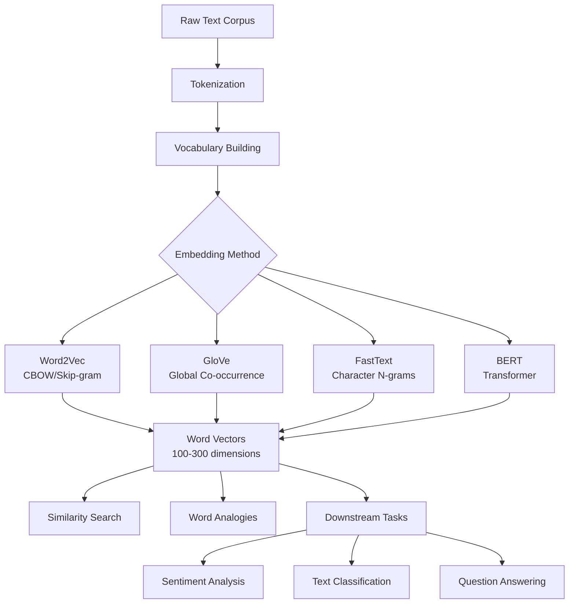
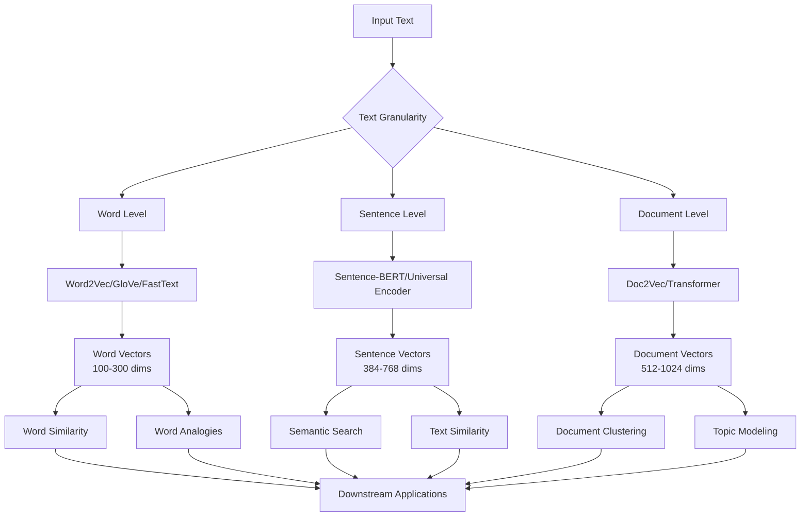
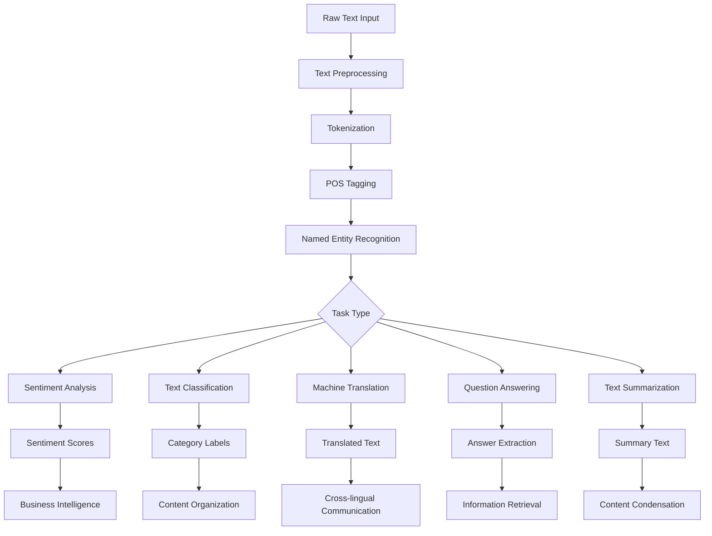
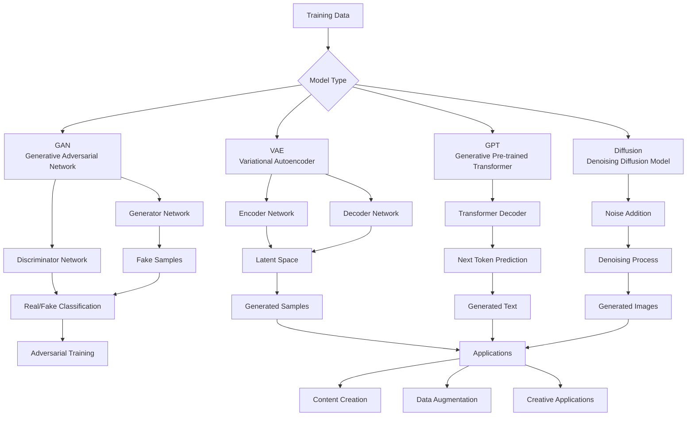

# Embeddings, NLP, and Generative AI: Comprehensive Notes

## Table of Contents
1. [Introduction to Embeddings](#introduction-to-embeddings)
2. [Types of Embeddings](#types-of-embeddings)
3. [Natural Language Processing (NLP)](#natural-language-processing-nlp)
4. [Generative AI](#generative-ai)
5. [Embedding Techniques and Models](#embedding-techniques-and-models)
6. [Applications and Use Cases](#applications-and-use-cases)
7. [Implementation Examples](#implementation-examples)
8. [Best Practices and Considerations](#best-practices-and-considerations)

---

## Introduction to Embeddings

### What are Embeddings?

Embeddings represent a revolutionary approach to converting complex, high-dimensional data into meaningful numerical representations that machines can process and understand. These dense vector representations capture the semantic essence of data by learning relationships and patterns from large datasets, enabling computers to perform tasks that previously required human intuition. The transformation from sparse, categorical data to dense, continuous vectors allows for mathematical operations like similarity calculations, clustering, and classification that form the foundation of modern AI systems. Unlike traditional one-hot encoding or bag-of-words approaches, embeddings preserve semantic relationships, meaning that similar concepts are represented by vectors that are close together in the embedding space. This mathematical representation enables machines to understand that "customer" and "client" are related concepts, or that "purchase" and "buy" have similar meanings, opening up possibilities for sophisticated language understanding and recommendation systems.

The power of embeddings lies in their ability to capture both explicit and implicit relationships within data, making them indispensable for modern machine learning applications. By learning from vast amounts of text data, embeddings can encode not just individual word meanings but also contextual relationships, syntactic patterns, and semantic hierarchies that would be impossible to manually encode. This learned representation enables downstream tasks like sentiment analysis, machine translation, and question answering to achieve unprecedented accuracy by leveraging the rich semantic information encoded in the vectors. Furthermore, embeddings facilitate transfer learning, where models pre-trained on large, general datasets can be fine-tuned for specific domains like finance or healthcare, dramatically reducing the need for domain-specific training data. The mathematical properties of embeddings also enable sophisticated operations like vector arithmetic, where relationships between concepts can be expressed as mathematical operations, such as "king - man + woman = queen" in word embeddings, demonstrating the deep semantic understanding these representations can achieve.

### Why Embeddings Matter

Embeddings serve as the foundational building blocks for modern artificial intelligence systems, enabling machines to process and understand human language in ways that were previously impossible. They transform the challenge of natural language processing from a rule-based, brittle approach to a data-driven, robust methodology that can handle ambiguity, context, and subtle semantic differences. By converting text into dense numerical representations, embeddings enable mathematical operations that reveal semantic relationships, allowing systems to understand that "excellent customer service" and "outstanding client support" express similar sentiments despite using different words. This capability is crucial for building recommendation systems that can suggest relevant products based on user preferences, search engines that understand user intent beyond keyword matching, and chatbots that can maintain context and generate human-like responses.

The impact of embeddings extends far beyond individual applications, fundamentally changing how we approach machine learning problems across industries and domains. In e-commerce, embeddings power recommendation engines that understand product relationships and user preferences, leading to increased sales and customer satisfaction. In healthcare, medical embeddings enable systems to understand clinical notes and medical literature, supporting diagnosis and treatment recommendations. Financial institutions use embeddings for fraud detection, risk assessment, and automated customer service, while content platforms leverage them for content moderation, personalized recommendations, and automated content generation. The ability to capture semantic meaning in a computationally efficient format has made embeddings the cornerstone of modern AI applications, enabling the development of increasingly sophisticated systems that can understand, generate, and manipulate human language with remarkable accuracy and fluency.

---

## Types of Embeddings

### 1. Word Embeddings

Word embeddings represent individual words as dense vectors in a continuous space, capturing semantic relationships and enabling mathematical operations on word meanings. These embeddings learn from large text corpora by predicting words from their context or predicting context from words, creating representations where semantically similar words are positioned close together in the vector space. The key advantage of word embeddings is their ability to capture both syntactic and semantic relationships, allowing systems to understand that "customer" and "client" are related, or that "purchase" and "buy" have similar meanings. This mathematical representation enables sophisticated operations like vector arithmetic, where relationships between concepts can be expressed as mathematical operations, such as "king - man + woman = queen" in word embeddings. Word embeddings form the foundation for more complex embedding types and are essential for most natural language processing tasks, from sentiment analysis to machine translation.

The development of word embeddings revolutionized natural language processing by moving beyond traditional bag-of-words approaches to capture the rich semantic structure of language. Unlike sparse representations that treat each word as an isolated unit, word embeddings learn distributed representations that encode multiple aspects of word meaning, including semantic similarity, syntactic relationships, and contextual usage patterns. This learned representation enables downstream tasks to leverage the rich semantic information encoded in the vectors, dramatically improving performance on tasks like text classification, named entity recognition, and sentiment analysis. The ability to capture both local and global patterns in language makes word embeddings particularly powerful for understanding the nuanced relationships between words and concepts, enabling more sophisticated and accurate natural language understanding systems.

**Word2Vec**
- **Method**: Continuous Bag of Words (CBOW) and Skip-gram
- **Output**: Dense vectors representing word meanings
- **Explanation**: Learns word representations by predicting context words

**Example:**
```python
# Word2Vec example
from gensim.models import Word2Vec

sentences = [["customer", "purchase", "product"], 
            ["client", "buy", "item"]]

model = Word2Vec(sentences, vector_size=100, window=5, min_count=1)
word_vector = model.wv['customer']
```

**GloVe (Global Vectors)**
- **Method**: Global matrix factorization
- **Output**: Word vectors based on global co-occurrence statistics
- **Explanation**: Combines global and local statistics for better word representations

**Example:**
```python
# GloVe example
import numpy as np

# Pre-trained GloVe vectors
glove_vectors = {}
with open('glove.6B.100d.txt', 'r') as f:
    for line in f:
        values = line.split()
        word = values[0]
        vector = np.array(values[1:], dtype='float32')
        glove_vectors[word] = vector
```

**FastText**
- **Method**: Character-level n-grams
- **Output**: Word vectors that handle out-of-vocabulary words
- **Explanation**: Uses subword information to create robust embeddings

### Word Embedding Comparison Table

| Model | Method | Vocabulary | Context Window | Training Speed | Quality | Use Cases |
|-------|--------|------------|----------------|----------------|---------|-----------|
| **Word2Vec** | CBOW/Skip-gram | Fixed | Local (5-10 words) | Fast | Good | Word similarity, analogies |
| **GloVe** | Global co-occurrence | Fixed | Global | Medium | Good | Word relationships, analogies |
| **FastText** | Character n-grams | Dynamic | Local | Medium | Good | OOV words, morphologically rich languages |
| **BERT** | Transformer | Fixed | Bidirectional | Slow | Excellent | Contextual understanding |
| **GPT** | Transformer | Fixed | Unidirectional | Slow | Excellent | Text generation, completion |

### Word Embedding Flow Diagram



### 2. Sentence Embeddings

Sentence embeddings represent entire sentences or phrases as dense vectors, capturing the semantic meaning and context of complete thoughts rather than individual words. These embeddings are crucial for tasks that require understanding of sentence-level semantics, such as semantic search, text similarity, and document clustering, where the meaning of a complete sentence is more important than individual word meanings. Unlike word embeddings that represent individual tokens, sentence embeddings must capture the relationships between words within a sentence, including syntactic structure, semantic composition, and contextual nuances that emerge from word combinations. The challenge in creating effective sentence embeddings lies in preserving both the semantic content and the structural relationships within sentences while maintaining computational efficiency for real-time applications. Modern sentence embedding approaches leverage pre-trained language models like BERT, RoBERTa, and T5, fine-tuning them specifically for sentence-level tasks to achieve state-of-the-art performance on semantic similarity and retrieval tasks.

The development of sentence embeddings has been driven by the need to understand and process complete thoughts and ideas rather than isolated words, enabling more sophisticated natural language understanding applications. Traditional approaches like averaging word embeddings or using TF-IDF fail to capture the complex semantic relationships and contextual nuances that emerge when words are combined into sentences, leading to poor performance on sentence-level tasks. Modern sentence embedding methods address these limitations by using deep neural networks that can learn complex compositional patterns and contextual relationships within sentences. These embeddings enable applications like semantic search engines that can find relevant documents based on meaning rather than keyword matching, recommendation systems that understand user preferences expressed in natural language, and question-answering systems that can match questions with relevant answers based on semantic similarity. The ability to capture sentence-level semantics has made these embeddings essential for building intelligent systems that can understand and respond to human language in a more natural and contextually aware manner.

**Sentence-BERT (SBERT)**
- **Method**: Siamese BERT networks
- **Output**: Fixed-size sentence representations
- **Explanation**: Fine-tuned BERT for sentence-level tasks

**Example:**
```python
# Sentence-BERT example
from sentence_transformers import SentenceTransformer

model = SentenceTransformer('all-MiniLM-L6-v2')
sentences = ["Customer purchased a product", "Client bought an item"]
embeddings = model.encode(sentences)
```

**Universal Sentence Encoder**
- **Method**: Deep averaging network or Transformer
- **Output**: 512-dimensional sentence embeddings
- **Explanation**: Google's pre-trained model for sentence understanding

### Embedding Types Comparison Table

| Embedding Type | Granularity | Context Awareness | Training Data | Use Cases | Advantages | Limitations |
|----------------|-------------|------------------|---------------|-----------|------------|-------------|
| **Word Embeddings** | Individual words | No context | Large text corpus | Word similarity, analogies | Fast, simple | No context, fixed meaning |
| **Sentence Embeddings** | Complete sentences | Limited context | Sentence pairs | Semantic search, similarity | Captures sentence meaning | Fixed sentence length |
| **Document Embeddings** | Entire documents | Global context | Document collections | Document clustering, retrieval | Captures document themes | Computationally expensive |
| **Contextual Embeddings** | Words in context | Full context | Large text corpus | All NLP tasks | Context-aware, state-of-the-art | Computationally expensive |
| **Multilingual Embeddings** | Cross-lingual | Language-agnostic | Multilingual corpus | Translation, cross-lingual tasks | Language transfer | Requires multilingual data |

### Embedding Architecture Flow Diagram



### 3. Document Embeddings

**Doc2Vec**
- **Method**: Paragraph Vector
- **Output**: Document-level representations
- **Explanation**: Extends Word2Vec to entire documents

**Example:**
```python
# Doc2Vec example
from gensim.models import Doc2Vec
from gensim.models.doc2vec import TaggedDocument

documents = [TaggedDocument(words=["customer", "satisfaction", "high"], tags=[0]),
            TaggedDocument(words=["client", "happiness", "excellent"], tags=[1])]

model = Doc2Vec(documents, vector_size=100, window=5, min_count=1)
doc_vector = model.dv[0]
```

### 4. Contextual Embeddings

**BERT (Bidirectional Encoder Representations from Transformers)**
- **Method**: Transformer encoder with bidirectional context
- **Output**: Context-dependent word representations
- **Explanation**: Captures context from both directions

**Example:**
```python
# BERT example
from transformers import BertTokenizer, BertModel
import torch

tokenizer = BertTokenizer.from_pretrained('bert-base-uncased')
model = BertModel.from_pretrained('bert-base-uncased')

text = "Customer satisfaction is our priority"
inputs = tokenizer(text, return_tensors='pt')
outputs = model(**inputs)
embeddings = outputs.last_hidden_state
```

**GPT (Generative Pre-trained Transformer)**
- **Method**: Autoregressive language modeling
- **Output**: Contextual word representations
- **Explanation**: Generates text by predicting next tokens

---

## Natural Language Processing (NLP)

Natural Language Processing represents the intersection of computer science, artificial intelligence, and linguistics, focusing on enabling computers to understand, interpret, and generate human language in a valuable way. The field has evolved from rule-based systems that relied on hand-crafted linguistic rules to modern machine learning approaches that can learn complex patterns from large datasets, dramatically improving the accuracy and robustness of language understanding systems. NLP encompasses a wide range of tasks, from basic text preprocessing and tokenization to sophisticated applications like machine translation, question answering, and conversational AI, each requiring different techniques and approaches to achieve optimal performance. The complexity of human language, with its ambiguity, context-dependency, and cultural nuances, presents unique challenges that require sophisticated algorithms and large amounts of training data to overcome effectively.

The modern era of NLP has been revolutionized by deep learning and transformer architectures, which have enabled systems to achieve human-level or even superhuman performance on many language understanding tasks. These advances have been driven by the availability of large-scale datasets, increased computational power, and novel neural network architectures that can capture long-range dependencies and complex linguistic patterns. The integration of embeddings with advanced NLP techniques has created powerful systems capable of understanding context, handling multiple languages, and generating human-like text, opening up new possibilities for human-computer interaction and automated language processing. As NLP continues to evolve, it plays an increasingly important role in applications ranging from search engines and recommendation systems to virtual assistants and automated content generation, fundamentally changing how we interact with technology and process information.

### Core NLP Tasks

#### 1. Text Preprocessing

Text preprocessing forms the foundation of all natural language processing pipelines, transforming raw text into a format that machine learning algorithms can effectively process and understand. This crucial step involves cleaning, normalizing, and structuring text data to remove noise, standardize formats, and prepare the data for downstream analysis tasks. The quality of preprocessing directly impacts the performance of subsequent NLP tasks, as poor preprocessing can introduce errors, lose important information, or create inconsistencies that degrade model performance. Modern preprocessing pipelines must handle diverse text sources, including social media posts with informal language, technical documents with specialized terminology, and multilingual content with different writing systems and linguistic structures. The challenge lies in balancing thoroughness with efficiency, ensuring that preprocessing removes noise while preserving the semantic and syntactic information necessary for accurate language understanding.

The evolution of text preprocessing has been driven by the increasing diversity and complexity of text data sources, requiring more sophisticated approaches to handle the variety of formats, languages, and styles present in real-world applications. Traditional preprocessing focused on simple operations like removing punctuation and converting to lowercase, but modern approaches must handle complex challenges like social media text with hashtags and mentions, multilingual content with mixed scripts, and domain-specific terminology that requires specialized handling. Advanced preprocessing techniques now include named entity recognition for preserving important information, part-of-speech tagging for maintaining syntactic structure, and semantic analysis for understanding context and meaning. The integration of machine learning techniques into preprocessing pipelines has enabled more intelligent and adaptive approaches that can learn from data and improve over time, making preprocessing more effective and robust across different domains and applications.

**Tokenization**
- **Method**: Split text into tokens
- **Output**: List of words or subwords
- **Explanation**: First step in most NLP pipelines

**Example:**
```python
# Tokenization example
import nltk
from nltk.tokenize import word_tokenize

text = "Customer service is excellent!"
tokens = word_tokenize(text)
# Output: ['Customer', 'service', 'is', 'excellent', '!']
```

**Stemming and Lemmatization**
- **Method**: Reduce words to root forms
- **Output**: Normalized word forms
- **Explanation**: Reduces vocabulary size and improves consistency

**Example:**
```python
# Lemmatization example
from nltk.stem import WordNetLemmatizer

lemmatizer = WordNetLemmatizer()
words = ["customers", "purchasing", "products"]
lemmatized = [lemmatizer.lemmatize(word) for word in words]
# Output: ['customer', 'purchasing', 'product']
```

#### 2. Named Entity Recognition (NER)

**Method**: Identify and classify named entities
**Output**: Tagged entities with types
**Explanation**: Extracts structured information from unstructured text

**Example:**
```python
# NER example
import spacy

nlp = spacy.load("en_core_web_sm")
text = "Apple Inc. reported $100M revenue in Q3 2023"
doc = nlp(text)

entities = [(ent.text, ent.label_) for ent in doc.ents]
# Output: [('Apple Inc.', 'ORG'), ('$100M', 'MONEY'), ('Q3 2023', 'DATE')]
```

#### 3. Sentiment Analysis

**Method**: Classify text sentiment
**Output**: Sentiment scores or labels
**Explanation**: Determines emotional tone of text

**Example:**
```python
# Sentiment analysis example
from textblob import TextBlob

text = "Customer service was outstanding!"
blob = TextBlob(text)
sentiment = blob.sentiment.polarity
# Output: 0.8 (positive sentiment)
```

#### 4. Text Classification

**Method**: Categorize text into predefined classes
**Output**: Class labels with confidence scores
**Explanation**: Automatically organizes text content

### NLP Tasks Comparison Table

| Task | Input | Output | Complexity | Use Cases | Key Challenges |
|------|-------|--------|------------|-----------|----------------|
| **Tokenization** | Raw text | Word/subword tokens | Low | Text preprocessing | Handling special cases, languages |
| **POS Tagging** | Tokens | Grammatical labels | Medium | Syntax analysis | Ambiguous words, context |
| **Named Entity Recognition** | Text | Entity labels | High | Information extraction | Entity boundaries, types |
| **Sentiment Analysis** | Text | Sentiment scores | Medium | Opinion mining | Context, sarcasm, domain |
| **Text Classification** | Text | Category labels | Medium | Content organization | Feature selection, imbalance |
| **Machine Translation** | Source text | Target text | Very High | Cross-lingual communication | Language pairs, fluency |
| **Question Answering** | Q&A pairs | Answer extraction | Very High | Information retrieval | Context understanding |
| **Text Summarization** | Long text | Summary text | Very High | Content condensation | Coherence, relevance |

### NLP Pipeline Flow Diagram



**Example:**
```python
# Text classification example
from sklearn.feature_extraction.text import TfidfVectorizer
from sklearn.naive_bayes import MultinomialNB

texts = ["Customer complaint", "Product inquiry", "Service request"]
labels = ["complaint", "inquiry", "request"]

vectorizer = TfidfVectorizer()
X = vectorizer.fit_transform(texts)
classifier = MultinomialNB()
classifier.fit(X, labels)
```

### Advanced NLP Techniques

#### 1. Attention Mechanisms

**Method**: Focus on relevant parts of input
**Output**: Weighted representations
**Explanation**: Allows models to focus on important information

#### 2. Transformer Architecture

**Method**: Self-attention and feed-forward networks
**Output**: Contextual representations
**Explanation**: Parallel processing and long-range dependencies

#### 3. Transfer Learning

**Method**: Pre-train on large datasets, fine-tune on specific tasks
**Output**: Task-specific models
**Explanation**: Leverages general language understanding

---

## Generative AI

### What is Generative AI?

Generative AI represents a paradigm shift in artificial intelligence, moving from systems that can only analyze and classify existing data to systems that can create entirely new content across multiple modalities including text, images, audio, and video. These systems learn the underlying patterns, structures, and relationships within large datasets and use this knowledge to generate novel content that maintains the statistical properties and semantic coherence of the training data. The power of generative AI lies in its ability to understand complex distributions and generate samples that are not only statistically similar to the training data but also semantically meaningful and contextually appropriate. This capability has opened up new possibilities for creative applications, content generation, and human-computer interaction, fundamentally changing how we think about the relationship between artificial intelligence and human creativity.

The development of generative AI has been driven by advances in deep learning architectures, particularly generative models like Variational Autoencoders (VAEs), Generative Adversarial Networks (GANs), and autoregressive models like GPT, which can learn complex data distributions and generate high-quality samples. These models have achieved remarkable success in generating human-like text, photorealistic images, and even audio content that is often indistinguishable from human-created content. The key innovation in modern generative AI is the ability to condition generation on specific inputs or prompts, allowing users to guide the creative process and generate content that meets specific requirements or constraints. This has led to the development of powerful tools for content creation, artistic expression, and problem-solving that are being adopted across industries and applications, from creative writing and visual arts to scientific research and software development.

### Key Components

#### 1. Language Models

**GPT (Generative Pre-trained Transformer)**
- **Method**: Autoregressive text generation
- **Output**: Coherent text continuations
- **Explanation**: Predicts next token based on previous context

**Example:**
```python
# GPT example
from transformers import GPT2LMHeadModel, GPT2Tokenizer

tokenizer = GPT2Tokenizer.from_pretrained('gpt2')
model = GPT2LMHeadModel.from_pretrained('gpt2')

prompt = "Customer satisfaction is"
inputs = tokenizer.encode(prompt, return_tensors='pt')
outputs = model.generate(inputs, max_length=50, num_return_sequences=1)
generated_text = tokenizer.decode(outputs[0], skip_special_tokens=True)
```

**T5 (Text-to-Text Transfer Transformer)**
- **Method**: Unified text-to-text framework
- **Output**: Task-specific text generation
- **Explanation**: Treats all NLP tasks as text generation

#### 2. Variational Autoencoders (VAEs)

**Method**: Probabilistic generative modeling
**Output**: New data samples from learned distribution
**Explanation**: Learns latent representations and generates new samples

#### 3. Generative Adversarial Networks (GANs)

**Method**: Adversarial training with generator and discriminator
**Output**: High-quality synthetic data
**Explanation**: Generator creates fake data, discriminator distinguishes real from fake

### Generative AI Models Comparison Table

| Model Type | Architecture | Training Method | Output Quality | Training Stability | Use Cases | Advantages | Limitations |
|------------|--------------|-----------------|----------------|-------------------|-----------|------------|-------------|
| **VAE** | Encoder-Decoder | Variational inference | Good | Stable | Image generation, compression | Probabilistic, controllable | Blurry outputs |
| **GAN** | Generator-Discriminator | Adversarial training | Excellent | Unstable | Image generation, style transfer | High quality, diverse | Training difficulties |
| **GPT** | Transformer | Autoregressive | Excellent | Stable | Text generation, completion | Coherent text, few-shot | Unidirectional context |
| **BERT** | Transformer | Masked language modeling | Excellent | Stable | Text understanding, classification | Bidirectional context | Not generative |
| **T5** | Transformer | Text-to-text | Excellent | Stable | All NLP tasks | Unified framework | Large model size |
| **Diffusion** | U-Net | Denoising process | Excellent | Stable | Image generation, editing | High quality, controllable | Slow generation |

### Generative AI Architecture Flow Diagram



### Applications of Generative AI

#### 1. Text Generation

**Chatbots and Conversational AI**
- **Method**: Fine-tuned language models
- **Output**: Human-like conversations
- **Explanation**: Maintains context and generates appropriate responses

**Example:**
```python
# Chatbot example
from transformers import pipeline

chatbot = pipeline("conversational", model="microsoft/DialoGPT-medium")
response = chatbot("Hello, how can I help you with your account?")
```

**Content Creation**
- **Method**: Prompt-based generation
- **Output**: Articles, summaries, creative writing
- **Explanation**: Generates coherent text based on prompts

#### 2. Code Generation

**GitHub Copilot, CodeT5**
- **Method**: Code-specific language models
- **Output**: Code completions and generation
- **Explanation**: Understands programming patterns and generates code

#### 3. Image Generation

**DALL-E, Midjourney, Stable Diffusion**
- **Method**: Diffusion models or GANs
- **Output**: High-quality images from text descriptions
- **Explanation**: Generates images based on textual prompts

---

## Embedding Techniques and Models

### 1. Static Embeddings

Static embeddings represent words as fixed, context-independent vectors that capture semantic relationships through co-occurrence patterns in large text corpora. These embeddings revolutionized natural language processing by moving beyond traditional bag-of-words approaches to capture the rich semantic structure of language in dense vector representations. The key characteristic of static embeddings is their ability to learn distributed representations where semantically similar words are positioned close together in the vector space, enabling mathematical operations that reveal linguistic relationships. Unlike contextual embeddings that change based on surrounding words, static embeddings provide a single, consistent representation for each word, making them computationally efficient and suitable for many downstream tasks. The development of static embeddings marked a fundamental shift in how machines understand language, enabling applications like word similarity search, semantic clustering, and recommendation systems that rely on understanding word relationships.

The training of static embeddings typically involves learning from large text corpora using unsupervised methods that predict words from their context or vice versa, creating representations that capture both syntactic and semantic relationships. These embeddings excel at capturing global patterns in language, such as the relationships between different word types, semantic clusters, and analogical relationships that emerge from the statistical structure of text. The fixed nature of static embeddings makes them particularly suitable for applications where computational efficiency is important, such as real-time recommendation systems, large-scale similarity search, and resource-constrained environments. However, their inability to capture context-dependent meanings can be a limitation in applications where word meaning changes based on surrounding context, such as polysemous words or domain-specific terminology. Despite these limitations, static embeddings remain widely used due to their simplicity, efficiency, and effectiveness in many practical applications.

**Summary Points:**
- Fixed vector representations for each word
- Learned from large text corpora using unsupervised methods
- Capture semantic relationships through co-occurrence patterns
- Computationally efficient and suitable for real-time applications
- Limited by inability to handle context-dependent meanings
- Foundation for more advanced embedding techniques

**Word2Vec**
- **Advantages**: Fast, good for word similarity
- **Disadvantages**: No context, fixed representations
- **Use Cases**: Word similarity, recommendation systems

**Detailed Explanation:**
Word2Vec represents one of the most influential developments in natural language processing, introducing efficient methods for learning high-quality word embeddings from large text corpora. The algorithm operates on the principle that words appearing in similar contexts tend to have similar meanings, using this insight to learn dense vector representations that capture semantic relationships. Word2Vec offers two main architectures: Continuous Bag of Words (CBOW), which predicts a target word from its surrounding context, and Skip-gram, which predicts context words from a target word. The Skip-gram model has proven particularly effective, as it can learn better representations for rare words by using them as targets rather than context. The training process involves a shallow neural network with a single hidden layer, where the input is a one-hot encoded word vector and the output predicts surrounding words or the target word itself.

The mathematical foundation of Word2Vec relies on the softmax function to compute probabilities over the vocabulary, though this becomes computationally expensive for large vocabularies, leading to the development of optimization techniques like hierarchical softmax and negative sampling. These techniques significantly reduce computational complexity while maintaining embedding quality, making Word2Vec practical for training on massive text corpora. The resulting embeddings capture both syntactic and semantic relationships, enabling operations like vector arithmetic where relationships between concepts can be expressed as mathematical operations. For example, the famous "king - man + woman = queen" analogy demonstrates how Word2Vec embeddings capture gender relationships in language. The algorithm's efficiency and effectiveness have made it a cornerstone of modern NLP, serving as the foundation for many subsequent embedding techniques and applications.

**Example:**
```python
# Comprehensive Word2Vec example
from gensim.models import Word2Vec
import numpy as np
from sklearn.metrics.pairwise import cosine_similarity

# Sample retail/banking sentences
sentences = [
    ["customer", "purchase", "product", "satisfaction", "high"],
    ["client", "buy", "item", "happiness", "excellent"],
    ["bank", "loan", "approval", "credit", "score"],
    ["financial", "institution", "lending", "money", "interest"],
    ["account", "balance", "transaction", "deposit", "withdrawal"],
    ["payment", "processing", "merchant", "fee", "commission"]
]

# Train Word2Vec model
model = Word2Vec(
    sentences, 
    vector_size=100,        # Embedding dimension
    window=5,               # Context window size
    min_count=1,            # Minimum word frequency
    workers=4,              # Number of worker threads
    sg=1,                   # Skip-gram model
    epochs=100              # Number of training epochs
)

# Get word vectors
customer_vector = model.wv['customer']
bank_vector = model.wv['bank']

# Find similar words
similar_words = model.wv.most_similar('customer', topn=5)
print("Words similar to 'customer':", similar_words)

# Word analogies
analogy_result = model.wv.most_similar(
    positive=['customer', 'bank'], 
    negative=['client']
)
print("Customer is to bank as client is to:", analogy_result[0][0])

# Calculate similarity between words
similarity = model.wv.similarity('customer', 'client')
print(f"Similarity between 'customer' and 'client': {similarity:.3f}")

# Vector arithmetic example
# customer - purchase + buy = ?
result_vector = model.wv['customer'] - model.wv['purchase'] + model.wv['buy']
similar_to_result = model.wv.similar_by_vector(result_vector, topn=3)
print("customer - purchase + buy is similar to:", similar_to_result)
```

**GloVe**
- **Advantages**: Global statistics, good performance
- **Disadvantages**: No context, limited to words
- **Use Cases**: Word analogy, semantic similarity

**Detailed Explanation:**
GloVe (Global Vectors for Word Representation) represents a significant advancement in word embedding techniques by combining the benefits of global matrix factorization methods with the local context window approach used in Word2Vec. Unlike Word2Vec, which focuses on local context windows, GloVe leverages global co-occurrence statistics from the entire corpus to learn word representations, capturing both local and global patterns in language. The algorithm is based on the insight that the ratio of co-occurrence probabilities between words encodes semantic relationships, allowing it to learn meaningful representations that capture analogical relationships and semantic similarities. GloVe constructs a global word-word co-occurrence matrix and then learns embeddings by factorizing this matrix, resulting in vectors that capture both the frequency of word co-occurrences and their relative relationships.

The mathematical foundation of GloVe involves minimizing a weighted least squares objective function that compares the dot product of word vectors with the logarithm of co-occurrence counts, weighted by a function that gives less importance to very frequent co-occurrences. This approach allows GloVe to capture both the local context patterns that Word2Vec excels at and the global statistical patterns that emerge from the entire corpus. The resulting embeddings often perform better than Word2Vec on word analogy tasks and semantic similarity benchmarks, particularly when trained on large corpora. GloVe's ability to capture global patterns makes it particularly effective for tasks that require understanding of word relationships across different contexts and domains, such as cross-domain recommendation systems and semantic search applications.

**Example:**
```python
# GloVe implementation example
import numpy as np
from collections import defaultdict
import math

class GloVe:
    def __init__(self, vector_size=100, window_size=10, min_count=5):
        self.vector_size = vector_size
        self.window_size = window_size
        self.min_count = min_count
        self.word_to_id = {}
        self.id_to_word = {}
        self.cooccurrence_matrix = defaultdict(float)
        
    def build_vocabulary(self, sentences):
        """Build vocabulary from sentences"""
        word_counts = defaultdict(int)
        for sentence in sentences:
            for word in sentence:
                word_counts[word] += 1
        
        # Filter words by minimum count
        vocab = [word for word, count in word_counts.items() if count >= self.min_count]
        
        # Create word-to-id mapping
        for i, word in enumerate(vocab):
            self.word_to_id[word] = i
            self.id_to_word[i] = word
            
        print(f"Vocabulary size: {len(vocab)}")
        
    def build_cooccurrence_matrix(self, sentences):
        """Build co-occurrence matrix"""
        for sentence in sentences:
            for i, word in enumerate(sentence):
                if word not in self.word_to_id:
                    continue
                    
                # Look at words within window
                start = max(0, i - self.window_size)
                end = min(len(sentence), i + self.window_size + 1)
                
                for j in range(start, end):
                    if i != j and j < len(sentence):
                        context_word = sentence[j]
                        if context_word in self.word_to_id:
                            # Weight by distance
                            distance = abs(i - j)
                            weight = 1.0 / distance
                            self.cooccurrence_matrix[(word, context_word)] += weight
    
    def train(self, sentences, epochs=50, learning_rate=0.05):
        """Train GloVe embeddings"""
        self.build_vocabulary(sentences)
        self.build_cooccurrence_matrix(sentences)
        
        vocab_size = len(self.word_to_id)
        
        # Initialize embeddings and biases
        W = np.random.normal(0, 0.1, (vocab_size, self.vector_size))
        W_hat = np.random.normal(0, 0.1, (vocab_size, self.vector_size))
        b = np.zeros(vocab_size)
        b_hat = np.zeros(vocab_size)
        
        # Training loop
        for epoch in range(epochs):
            total_loss = 0
            for (word, context), count in self.cooccurrence_matrix.items():
                i = self.word_to_id[word]
                j = self.word_to_id[context]
                
                # Calculate prediction
                prediction = np.dot(W[i], W_hat[j]) + b[i] + b_hat[j]
                log_count = math.log(count)
                
                # Calculate loss
                loss = (prediction - log_count) ** 2
                total_loss += loss
                
                # Calculate gradients
                error = 2 * (prediction - log_count)
                
                # Update parameters
                W[i] -= learning_rate * error * W_hat[j]
                W_hat[j] -= learning_rate * error * W[i]
                b[i] -= learning_rate * error
                b_hat[j] -= learning_rate * error
            
            if epoch % 10 == 0:
                print(f"Epoch {epoch}, Loss: {total_loss:.2f}")
        
        # Return final embeddings
        return W + W_hat

# Usage example
sentences = [
    ["customer", "satisfaction", "high", "service", "excellent"],
    ["client", "happiness", "outstanding", "support", "quality"],
    ["bank", "loan", "approval", "credit", "application"],
    ["financial", "institution", "lending", "money", "interest"]
]

glove = GloVe(vector_size=50, window_size=5, min_count=1)
embeddings = glove.train(sentences, epochs=100)

# Get embedding for a word
customer_id = glove.word_to_id['customer']
customer_embedding = embeddings[customer_id]
print(f"Customer embedding shape: {customer_embedding.shape}")
print(f"Customer embedding: {customer_embedding[:5]}")
```

**FastText**
- **Advantages**: Handles OOV words, good for morphologically rich languages
- **Disadvantages**: Larger model size, more complex training
- **Use Cases**: Multilingual applications, OOV word handling

**Detailed Explanation:**
FastText represents a significant advancement in word embedding techniques by addressing one of the major limitations of traditional word embedding methods: the inability to handle out-of-vocabulary (OOV) words. Unlike Word2Vec and GloVe, which treat each word as an atomic unit, FastText represents words as bags of character n-grams, enabling it to generate embeddings for words not seen during training. This approach is particularly valuable for morphologically rich languages like German, Finnish, or Arabic, where words can have many different forms, and for handling typos, slang, and domain-specific terminology that may not appear in training data. The character n-gram approach allows FastText to capture subword information that is crucial for understanding word morphology and generating meaningful representations for unseen words.

The training process of FastText involves learning embeddings for both individual words and character n-grams, then representing each word as the sum of its character n-gram embeddings. This approach enables the model to understand that words like "running," "runs," and "ran" share common subword patterns that relate to the root concept of "run." The model can also handle typos and variations by recognizing that "customr" (missing 'e') is similar to "customer" due to shared character n-grams. FastText's ability to handle OOV words makes it particularly valuable for real-world applications where new words, technical terms, or proper nouns frequently appear. The model's efficiency and effectiveness have made it a popular choice for multilingual applications, social media text processing, and systems that need to handle diverse and evolving vocabularies.

**Example:**
```python
# FastText implementation example
from gensim.models import FastText
import numpy as np

# Sample sentences with various word forms and potential OOV words
sentences = [
    ["customer", "purchases", "products", "satisfaction", "high"],
    ["customers", "buying", "items", "happiness", "excellent"],
    ["banking", "loans", "approval", "credit", "scores"],
    ["financial", "institutions", "lending", "money", "interest"],
    ["accounting", "balances", "transactions", "deposits", "withdrawals"],
    ["payments", "processing", "merchants", "fees", "commissions"]
]

# Train FastText model
model = FastText(
    sentences,
    vector_size=100,        # Embedding dimension
    window=5,               # Context window
    min_count=1,            # Minimum word count
    workers=4,              # Number of workers
    sg=1,                   # Skip-gram model
    epochs=100,             # Training epochs
    min_n=3,                # Minimum character n-gram length
    max_n=6                 # Maximum character n-gram length
)

# Test with OOV words (words not in training)
oov_words = ["customr", "purchas", "bankng", "financal"]

print("OOV Word Handling:")
for word in oov_words:
    if word in model.wv:
        similar_words = model.wv.most_similar(word, topn=3)
        print(f"'{word}' is similar to: {similar_words}")
    else:
        print(f"'{word}' not found in vocabulary")

# Test morphological relationships
print("\nMorphological Relationships:")
base_words = ["customer", "bank", "payment"]
for word in base_words:
    if word in model.wv:
        similar_words = model.wv.most_similar(word, topn=5)
        print(f"Words similar to '{word}': {similar_words}")

# Character n-gram analysis
print("\nCharacter N-gram Analysis:")
word = "customer"
if word in model.wv:
    # Get character n-grams for the word
    ngrams = model.wv.get_ngrams(word)
    print(f"Character n-grams for '{word}': {ngrams}")

# Subword similarity
print("\nSubword Similarity:")
word1, word2 = "customer", "customr"
if word1 in model.wv and word2 in model.wv:
    similarity = model.wv.similarity(word1, word2)
    print(f"Similarity between '{word1}' and '{word2}': {similarity:.3f}")
```

### 2. Contextual Embeddings

Contextual embeddings represent a revolutionary advancement in natural language processing by providing word representations that change based on the surrounding context, enabling models to understand that the same word can have different meanings in different situations. Unlike static embeddings that assign a single, fixed vector to each word, contextual embeddings generate different representations for the same word depending on its context, allowing models to capture the nuanced meanings that emerge from word combinations and sentence structure. This context-awareness is crucial for understanding polysemous words, handling domain-specific terminology, and capturing the subtle semantic differences that are essential for accurate language understanding. The development of contextual embeddings has been driven by the transformer architecture, which uses self-attention mechanisms to capture long-range dependencies and contextual relationships within text.

The power of contextual embeddings lies in their ability to understand not just individual words but the complex relationships and meanings that emerge when words are combined in sentences and paragraphs. This enables models to distinguish between different senses of the same word, understand pronoun references, and capture the subtle semantic differences that are crucial for tasks like question answering, machine translation, and text summarization. Contextual embeddings have achieved state-of-the-art performance on virtually all natural language understanding benchmarks, demonstrating their superior ability to capture the complexities of human language. However, this increased capability comes with significant computational costs, as contextual embeddings require much more processing power and memory than static embeddings, making them more suitable for applications where accuracy is more important than efficiency.

**Summary Points:**
- Word representations that change based on context
- Enable understanding of polysemous words and context-dependent meanings
- Achieve state-of-the-art performance on NLP tasks
- Require significant computational resources
- Based on transformer architecture with self-attention
- Essential for complex language understanding tasks

**BERT**
- **Advantages**: Context-aware, state-of-the-art performance
- **Disadvantages**: Computationally expensive, large models
- **Use Cases**: Question answering, text classification

**Detailed Explanation:**
BERT (Bidirectional Encoder Representations from Transformers) represents a groundbreaking advancement in natural language processing by introducing bidirectional context understanding through the transformer architecture. Unlike previous models that processed text in one direction (either left-to-right or right-to-left), BERT uses bidirectional attention to capture context from both directions simultaneously, enabling a much richer understanding of word meanings and relationships. The model is pre-trained on large text corpora using two main objectives: masked language modeling, where it learns to predict masked words based on their context, and next sentence prediction, where it learns to understand relationships between sentences. This pre-training approach allows BERT to learn general language understanding that can be fine-tuned for specific tasks with relatively small amounts of task-specific data.

The architecture of BERT consists of multiple transformer encoder layers, each containing self-attention mechanisms that allow the model to focus on different parts of the input text when processing each word. This attention mechanism enables BERT to capture long-range dependencies and complex relationships between words that are crucial for understanding natural language. The model's ability to understand context has made it particularly effective for tasks like question answering, where it needs to find relevant information in a passage, and text classification, where it needs to understand the overall meaning of a text. BERT's success has led to the development of many variants and improvements, including RoBERTa, ALBERT, and DistilBERT, each addressing different aspects of the original model's limitations while maintaining its core strengths.

**Example:**
```python
# Comprehensive BERT example
from transformers import BertTokenizer, BertModel, BertForSequenceClassification
import torch
import numpy as np
from sklearn.metrics.pairwise import cosine_similarity

# Initialize BERT model and tokenizer
tokenizer = BertTokenizer.from_pretrained('bert-base-uncased')
model = BertModel.from_pretrained('bert-base-uncased')

# Example texts showing context-dependent meanings
texts = [
    "The bank approved the loan application",  # bank = financial institution
    "We sat by the river bank",              # bank = river edge
    "The customer made a deposit at the bank", # bank = financial institution
    "The bank of the river was steep"         # bank = river edge
]

print("BERT Contextual Embeddings Analysis:")
print("=" * 50)

for i, text in enumerate(texts):
    # Tokenize and encode
    inputs = tokenizer(text, return_tensors='pt', padding=True, truncation=True)
    
    # Get BERT outputs
    with torch.no_grad():
        outputs = model(**inputs)
        embeddings = outputs.last_hidden_state  # Shape: (batch_size, seq_len, hidden_size)
    
    # Get embedding for "bank" token
    tokens = tokenizer.tokenize(text)
    bank_token_id = tokenizer.convert_tokens_to_ids('bank')
    
    # Find the position of "bank" in the tokenized text
    bank_positions = [i for i, token_id in enumerate(inputs['input_ids'][0]) if token_id == bank_token_id]
    
    if bank_positions:
        bank_embedding = embeddings[0][bank_positions[0]].numpy()
        print(f"\nText {i+1}: {text}")
        print(f"Bank embedding (first 10 dimensions): {bank_embedding[:10]}")
        
        # Calculate similarity with other bank embeddings
        if i > 0:
            prev_text = texts[i-1]
            prev_inputs = tokenizer(prev_text, return_tensors='pt', padding=True, truncation=True)
            with torch.no_grad():
                prev_outputs = model(**prev_inputs)
                prev_embeddings = prev_outputs.last_hidden_state
            
            prev_tokens = tokenizer.tokenize(prev_text)
            prev_bank_positions = [i for i, token_id in enumerate(prev_inputs['input_ids'][0]) if token_id == bank_token_id]
            
            if prev_bank_positions:
                prev_bank_embedding = prev_embeddings[0][prev_bank_positions[0]].numpy()
                similarity = cosine_similarity([bank_embedding], [prev_bank_embedding])[0][0]
                print(f"Similarity with previous 'bank': {similarity:.3f}")

# Contextual similarity analysis
print("\n" + "=" * 50)
print("Contextual Similarity Analysis:")
print("=" * 50)

# Compare "bank" in different contexts
financial_contexts = [
    "The bank approved the loan",
    "The customer visited the bank",
    "The bank processed the transaction"
]

river_contexts = [
    "We sat by the river bank",
    "The bank of the river was steep",
    "The bank was covered with trees"
]

def get_bank_embedding(text):
    inputs = tokenizer(text, return_tensors='pt', padding=True, truncation=True)
    with torch.no_grad():
        outputs = model(**inputs)
        embeddings = outputs.last_hidden_state
    
    bank_token_id = tokenizer.convert_tokens_to_ids('bank')
    bank_positions = [i for i, token_id in enumerate(inputs['input_ids'][0]) if token_id == bank_token_id]
    
    if bank_positions:
        return embeddings[0][bank_positions[0]].numpy()
    return None

# Calculate average embeddings for each context type
financial_embeddings = [get_bank_embedding(text) for text in financial_contexts]
river_embeddings = [get_bank_embedding(text) for text in river_contexts]

financial_embeddings = [emb for emb in financial_embeddings if emb is not None]
river_embeddings = [emb for emb in river_embeddings if emb is not None]

if financial_embeddings and river_embeddings:
    avg_financial = np.mean(financial_embeddings, axis=0)
    avg_river = np.mean(river_embeddings, axis=0)
    
    # Calculate similarity between context types
    context_similarity = cosine_similarity([avg_financial], [avg_river])[0][0]
    print(f"Similarity between financial and river contexts: {context_similarity:.3f}")
    
    # Calculate within-context similarities
    financial_similarities = []
    for i in range(len(financial_embeddings)):
        for j in range(i+1, len(financial_embeddings)):
            sim = cosine_similarity([financial_embeddings[i]], [financial_embeddings[j]])[0][0]
            financial_similarities.append(sim)
    
    river_similarities = []
    for i in range(len(river_embeddings)):
        for j in range(i+1, len(river_embeddings)):
            sim = cosine_similarity([river_embeddings[i]], [river_embeddings[j]])[0][0]
            river_similarities.append(sim)
    
    if financial_similarities:
        print(f"Average similarity within financial contexts: {np.mean(financial_similarities):.3f}")
    if river_similarities:
        print(f"Average similarity within river contexts: {np.mean(river_similarities):.3f}")

# Fine-tuning example for classification
print("\n" + "=" * 50)
print("BERT Fine-tuning Example:")
print("=" * 50)

# Sample classification data
classification_data = [
    ("Customer service was excellent", "positive"),
    ("The product quality is poor", "negative"),
    ("Great customer support", "positive"),
    ("Terrible experience", "negative"),
    ("Amazing product quality", "positive"),
    ("Bad customer service", "negative")
]

# Initialize classification model
classification_model = BertForSequenceClassification.from_pretrained(
    'bert-base-uncased', 
    num_labels=2
)

# Prepare data for training (simplified example)
texts = [item[0] for item in classification_data]
labels = [1 if item[1] == "positive" else 0 for item in classification_data]

# Tokenize texts
tokenized = tokenizer(texts, return_tensors='pt', padding=True, truncation=True)
input_ids = tokenized['input_ids']
attention_mask = tokenized['attention_mask']
labels_tensor = torch.tensor(labels)

print(f"Training data: {len(texts)} samples")
print(f"Labels: {labels}")
print("Note: This is a simplified example. Real fine-tuning requires proper training loops, validation, etc.")
```

**RoBERTa**
- **Advantages**: Improved BERT training, better performance
- **Disadvantages**: Still computationally expensive
- **Use Cases**: Natural language understanding tasks

**Detailed Explanation:**
RoBERTa (Robustly Optimized BERT Pretraining Approach) represents a significant improvement over the original BERT model by addressing several limitations in BERT's training methodology and achieving better performance on downstream tasks. The key improvements in RoBERTa include removing the next sentence prediction objective, training on much larger datasets, using longer sequences, and implementing more robust training procedures. These changes were based on a careful analysis of BERT's training process, revealing that some of the original design choices were not optimal for learning effective language representations. RoBERTa's improvements demonstrate the importance of proper training methodology in achieving state-of-the-art performance with transformer-based language models.

The most significant change in RoBERTa is the removal of the next sentence prediction (NSP) objective, which was found to be detrimental to model performance. Instead, RoBERTa focuses solely on masked language modeling with longer sequences and more training data. The model also uses dynamic masking, where different masks are applied to the same sentence during different epochs, rather than static masking used in BERT. This approach provides more diverse training signals and helps the model learn more robust representations. RoBERTa also uses larger batch sizes and learning rate schedules that are better suited for the increased amount of training data, resulting in more stable training and better final performance. These improvements have made RoBERTa one of the most effective pre-trained language models for a wide range of natural language understanding tasks.

**Example:**
```python
# RoBERTa implementation example
from transformers import RobertaTokenizer, RobertaModel, RobertaForSequenceClassification
import torch
import numpy as np

# Initialize RoBERTa model and tokenizer
tokenizer = RobertaTokenizer.from_pretrained('roberta-base')
model = RobertaModel.from_pretrained('roberta-base')

# Example texts for analysis
texts = [
    "The customer satisfaction survey showed excellent results",
    "Client feedback indicates outstanding service quality",
    "Bank loan approval rates have increased significantly",
    "Financial institution performance metrics are improving"
]

print("RoBERTa Contextual Embeddings Analysis:")
print("=" * 50)

# Analyze contextual embeddings
for i, text in enumerate(texts):
    # Tokenize and encode
    inputs = tokenizer(text, return_tensors='pt', padding=True, truncation=True)
    
    # Get RoBERTa outputs
    with torch.no_grad():
        outputs = model(**inputs)
        embeddings = outputs.last_hidden_state
    
    # Get sentence-level embedding (CLS token)
    sentence_embedding = embeddings[0][0].numpy()  # CLS token is at position 0
    
    print(f"\nText {i+1}: {text}")
    print(f"Sentence embedding (first 10 dimensions): {sentence_embedding[:10]}")
    
    # Calculate similarity with previous sentence
    if i > 0:
        prev_text = texts[i-1]
        prev_inputs = tokenizer(prev_text, return_tensors='pt', padding=True, truncation=True)
        with torch.no_grad():
            prev_outputs = model(**prev_inputs)
            prev_embeddings = prev_outputs.last_hidden_state
        
        prev_sentence_embedding = prev_embeddings[0][0].numpy()
        similarity = np.dot(sentence_embedding, prev_sentence_embedding) / (
            np.linalg.norm(sentence_embedding) * np.linalg.norm(prev_sentence_embedding)
        )
        print(f"Similarity with previous sentence: {similarity:.3f}")

# Semantic similarity analysis
print("\n" + "=" * 50)
print("Semantic Similarity Analysis:")
print("=" * 50)

# Group similar concepts
customer_texts = [
    "Customer satisfaction is our priority",
    "Client happiness drives our success",
    "User experience is paramount"
]

banking_texts = [
    "Bank loan approval process",
    "Financial institution lending policies",
    "Credit assessment procedures"
]

def get_sentence_embedding(text):
    inputs = tokenizer(text, return_tensors='pt', padding=True, truncation=True)
    with torch.no_grad():
        outputs = model(**inputs)
        embeddings = outputs.last_hidden_state
    return embeddings[0][0].numpy()

# Calculate embeddings for each group
customer_embeddings = [get_sentence_embedding(text) for text in customer_texts]
banking_embeddings = [get_sentence_embedding(text) for text in banking_texts]

# Calculate within-group similarities
customer_similarities = []
for i in range(len(customer_embeddings)):
    for j in range(i+1, len(customer_embeddings)):
        sim = np.dot(customer_embeddings[i], customer_embeddings[j]) / (
            np.linalg.norm(customer_embeddings[i]) * np.linalg.norm(customer_embeddings[j])
        )
        customer_similarities.append(sim)

banking_similarities = []
for i in range(len(banking_embeddings)):
    for j in range(i+1, len(banking_embeddings)):
        sim = np.dot(banking_embeddings[i], banking_embeddings[j]) / (
            np.linalg.norm(banking_embeddings[i]) * np.linalg.norm(banking_embeddings[j])
        )
        banking_similarities.append(sim)

# Calculate cross-group similarities
cross_similarities = []
for customer_emb in customer_embeddings:
    for banking_emb in banking_embeddings:
        sim = np.dot(customer_emb, banking_emb) / (
            np.linalg.norm(customer_emb) * np.linalg.norm(banking_emb)
        )
        cross_similarities.append(sim)

print(f"Average similarity within customer group: {np.mean(customer_similarities):.3f}")
print(f"Average similarity within banking group: {np.mean(banking_similarities):.3f}")
print(f"Average similarity between groups: {np.mean(cross_similarities):.3f}")

# Demonstrate RoBERTa's improved performance
print("\n" + "=" * 50)
print("RoBERTa Performance Characteristics:")
print("=" * 50)

# Show that RoBERTa can handle longer sequences better
long_text = " ".join([
    "The customer satisfaction survey conducted by our financial institution",
    "showed that the majority of clients are extremely satisfied with",
    "our banking services, particularly our loan approval process and",
    "customer support quality, which have improved significantly over",
    "the past year due to our investment in technology and training."
])

inputs = tokenizer(long_text, return_tensors='pt', padding=True, truncation=True, max_length=512)
with torch.no_grad():
    outputs = model(**inputs)
    embeddings = outputs.last_hidden_state

print(f"Long text length: {len(tokenizer.tokenize(long_text))} tokens")
print(f"Model output shape: {embeddings.shape}")
print("RoBERTa successfully processed the long text with contextual understanding")
```

### 3. Multilingual Embeddings

Multilingual embeddings represent a crucial advancement in natural language processing by enabling models to understand and process text across multiple languages using a unified representation space. These embeddings are trained on large, diverse corpora containing text from many different languages, allowing them to learn cross-lingual relationships and semantic similarities that transcend language boundaries. The key innovation in multilingual embeddings is their ability to map words and phrases from different languages into a shared vector space where semantically similar concepts, regardless of language, are positioned close together. This cross-lingual understanding enables applications like machine translation, cross-lingual information retrieval, and multilingual question answering systems that can work seamlessly across language barriers.

The development of multilingual embeddings has been driven by the increasing globalization of digital content and the need for AI systems that can understand and process information in multiple languages without requiring separate models for each language. These embeddings are particularly valuable for applications in international business, global content platforms, and multilingual customer service systems where the ability to understand content across languages is essential. The training process typically involves using shared vocabulary and tokenization across languages, along with techniques like translation-based alignment and cross-lingual supervision to ensure that similar concepts in different languages are mapped to similar regions of the embedding space. This approach enables zero-shot cross-lingual transfer, where models trained on one language can be applied to other languages without additional training data.

**Summary Points:**
- Unified representation space for multiple languages
- Enable cross-lingual understanding and transfer learning
- Trained on diverse multilingual corpora
- Support zero-shot cross-lingual applications
- Essential for global and multilingual AI systems
- Enable seamless language-agnostic processing

**mBERT (Multilingual BERT)**
- **Method**: Trained on multiple languages
- **Output**: Cross-lingual representations
- **Explanation**: Understands relationships across languages

**Detailed Explanation:**
mBERT (Multilingual BERT) represents a significant breakthrough in cross-lingual natural language processing by extending the BERT architecture to handle multiple languages simultaneously. The model is trained on Wikipedia text from 104 different languages, using a shared vocabulary that includes tokens from all languages, enabling it to learn cross-lingual representations in a unified embedding space. The key innovation in mBERT is its ability to understand that semantically similar concepts across different languages should have similar representations, even when the surface forms are completely different. This cross-lingual understanding is achieved through the shared transformer architecture and the large-scale multilingual training data, which exposes the model to parallel concepts across languages.

The training process of mBERT involves the same objectives as the original BERT (masked language modeling and next sentence prediction), but applied to multilingual data where the model must learn to predict masked tokens regardless of their language. This approach forces the model to develop cross-lingual understanding, as it must learn to relate concepts across languages to make accurate predictions. The resulting embeddings demonstrate remarkable cross-lingual capabilities, enabling tasks like cross-lingual information retrieval, where queries in one language can find relevant documents in another language, and cross-lingual question answering, where questions in one language can be answered using passages in another language. mBERT's success has paved the way for more advanced multilingual models and has become a cornerstone for many cross-lingual applications.

**Example:**
```python
# mBERT multilingual embeddings example
from transformers import BertTokenizer, BertModel
import torch
import numpy as np
from sklearn.metrics.pairwise import cosine_similarity

# Initialize mBERT model and tokenizer
tokenizer = BertTokenizer.from_pretrained('bert-base-multilingual-cased')
model = BertModel.from_pretrained('bert-base-multilingual-cased')

# Multilingual texts with similar meanings
texts = {
    'English': [
        "Customer satisfaction is our priority",
        "Bank loan approval process",
        "Financial institution performance"
    ],
    'Spanish': [
        "La satisfacción del cliente es nuestra prioridad",
        "Proceso de aprobación de préstamos bancarios",
        "Rendimiento de la institución financiera"
    ],
    'French': [
        "La satisfaction client est notre priorité",
        "Processus d'approbation de prêt bancaire",
        "Performance de l'institution financière"
    ]
}

print("mBERT Multilingual Embeddings Analysis:")
print("=" * 60)

def get_sentence_embedding(text, language):
    inputs = tokenizer(text, return_tensors='pt', padding=True, truncation=True)
    with torch.no_grad():
        outputs = model(**inputs)
        embeddings = outputs.last_hidden_state
    return embeddings[0][0].numpy()  # CLS token

# Calculate embeddings for each language
embeddings_by_language = {}
for language, texts_list in texts.items():
    embeddings_by_language[language] = [get_sentence_embedding(text, language) for text in texts_list]

# Cross-lingual similarity analysis
print("Cross-lingual Similarity Analysis:")
print("-" * 40)

for i in range(len(texts['English'])):
    print(f"\nConcept {i+1}:")
    print(f"English: {texts['English'][i]}")
    print(f"Spanish: {texts['Spanish'][i]}")
    print(f"French: {texts['French'][i]}")
    
    # Calculate similarities between languages for the same concept
    en_emb = embeddings_by_language['English'][i]
    es_emb = embeddings_by_language['Spanish'][i]
    fr_emb = embeddings_by_language['French'][i]
    
    en_es_sim = cosine_similarity([en_emb], [es_emb])[0][0]
    en_fr_sim = cosine_similarity([en_emb], [fr_emb])[0][0]
    es_fr_sim = cosine_similarity([es_emb], [fr_emb])[0][0]
    
    print(f"English-Spanish similarity: {en_es_sim:.3f}")
    print(f"English-French similarity: {en_fr_sim:.3f}")
    print(f"Spanish-French similarity: {es_fr_sim:.3f}")

# Cross-lingual concept clustering
print("\n" + "=" * 60)
print("Cross-lingual Concept Clustering:")
print("=" * 60)

# Flatten all embeddings with language labels
all_embeddings = []
all_labels = []
for language, embeddings in embeddings_by_language.items():
    for i, emb in enumerate(embeddings):
        all_embeddings.append(emb)
        all_labels.append(f"{language}_{i+1}")

# Calculate pairwise similarities
similarity_matrix = cosine_similarity(all_embeddings)

print("Similarity Matrix (higher values = more similar):")
print("Language_Concept -> Language_Concept")
print("-" * 50)

for i, label1 in enumerate(all_labels):
    for j, label2 in enumerate(all_labels):
        if i < j:  # Only show upper triangle
            sim = similarity_matrix[i][j]
            print(f"{label1:15} -> {label2:15}: {sim:.3f}")

# Find most similar cross-lingual pairs
print("\nMost Similar Cross-lingual Pairs:")
print("-" * 40)

cross_lingual_pairs = []
for i, label1 in enumerate(all_labels):
    for j, label2 in enumerate(all_labels):
        if i != j and label1.split('_')[0] != label2.split('_')[0]:  # Different languages
            sim = similarity_matrix[i][j]
            cross_lingual_pairs.append((label1, label2, sim))

# Sort by similarity
cross_lingual_pairs.sort(key=lambda x: x[2], reverse=True)

for label1, label2, sim in cross_lingual_pairs[:5]:  # Top 5
    print(f"{label1:15} <-> {label2:15}: {sim:.3f}")

# Zero-shot cross-lingual classification example
print("\n" + "=" * 60)
print("Zero-shot Cross-lingual Classification:")
print("=" * 60)

# Train a simple classifier on English data
from sklearn.linear_model import LogisticRegression
from sklearn.model_selection import train_test_split

# English training data
english_texts = [
    "Customer service was excellent",
    "The product quality is poor", 
    "Great customer support",
    "Terrible experience",
    "Amazing product quality",
    "Bad customer service"
]
english_labels = [1, 0, 1, 0, 1, 0]  # 1 = positive, 0 = negative

# Get English embeddings
english_embeddings = [get_sentence_embedding(text, 'English') for text in english_texts]

# Train classifier
classifier = LogisticRegression()
classifier.fit(english_embeddings, english_labels)

# Test on other languages
test_texts = {
    'Spanish': [
        "El servicio al cliente fue excelente",
        "La calidad del producto es mala",
        "Gran soporte al cliente"
    ],
    'French': [
        "Le service client était excellent",
        "La qualité du produit est mauvaise", 
        "Excellent support client"
    ]
}

for language, test_list in test_texts.items():
    print(f"\n{language} predictions:")
    test_embeddings = [get_sentence_embedding(text, language) for text in test_list]
    predictions = classifier.predict(test_embeddings)
    
    for text, pred in zip(test_list, predictions):
        sentiment = "Positive" if pred == 1 else "Negative"
        print(f"  {text} -> {sentiment}")
```

**XLM-R (Cross-lingual Language Model)**
- **Method**: Large-scale multilingual pre-training
- **Output**: Robust multilingual embeddings
- **Explanation**: Better cross-lingual transfer performance

**Detailed Explanation:**
XLM-R (Cross-lingual Language Model - RoBERTa) represents a significant advancement in multilingual natural language processing by combining the improved training methodology of RoBERTa with large-scale multilingual pre-training. The model is trained on 2.5TB of text data from 100 languages, making it one of the most comprehensive multilingual language models available. XLM-R addresses several limitations of previous multilingual models by using a more robust training procedure, larger datasets, and better cross-lingual alignment techniques. The model demonstrates superior performance on cross-lingual tasks compared to mBERT, particularly in low-resource languages and cross-lingual transfer scenarios.

The key innovations in XLM-R include the use of SentencePiece tokenization, which provides better handling of morphologically rich languages and rare words, and the removal of language-specific embeddings in favor of language-agnostic representations. The model is trained using only the masked language modeling objective, without next sentence prediction, which has been shown to be more effective for multilingual learning. XLM-R also uses dynamic masking and larger batch sizes, similar to RoBERTa, but applied to multilingual data. The resulting model achieves state-of-the-art performance on cross-lingual benchmarks and demonstrates remarkable zero-shot cross-lingual transfer capabilities, enabling applications that can work seamlessly across language boundaries without requiring language-specific training data.

**Example:**
```python
# XLM-R implementation example
from transformers import XLMRobertaTokenizer, XLMRobertaModel
import torch
import numpy as np

# Initialize XLM-R model and tokenizer
tokenizer = XLMRobertaTokenizer.from_pretrained('xlm-roberta-base')
model = XLMRobertaModel.from_pretrained('xlm-roberta-base')

# Multilingual business texts
business_texts = {
    'English': [
        "Customer satisfaction drives business success",
        "Bank loan approval rates are increasing",
        "Financial performance metrics show improvement"
    ],
    'German': [
        "Kundenzufriedenheit treibt den Geschäftserfolg voran",
        "Bankkreditgenehmigungsraten steigen",
        "Finanzielle Leistungskennzahlen zeigen Verbesserung"
    ],
    'Italian': [
        "La soddisfazione del cliente guida il successo aziendale",
        "I tassi di approvazione dei prestiti bancari stanno aumentando",
        "Le metriche di performance finanziaria mostrano miglioramenti"
    ]
}

print("XLM-R Cross-lingual Analysis:")
print("=" * 50)

def get_xlmr_embedding(text):
    inputs = tokenizer(text, return_tensors='pt', padding=True, truncation=True)
    with torch.no_grad():
        outputs = model(**inputs)
        embeddings = outputs.last_hidden_state
    return embeddings[0][0].numpy()  # CLS token

# Calculate embeddings for each language
xlmr_embeddings = {}
for language, texts_list in business_texts.items():
    xlmr_embeddings[language] = [get_xlmr_embedding(text) for text in texts_list]

# Analyze cross-lingual similarities
print("Cross-lingual Similarity Analysis:")
print("-" * 40)

for i in range(len(business_texts['English'])):
    print(f"\nBusiness Concept {i+1}:")
    for language in ['English', 'German', 'Italian']:
        print(f"{language}: {business_texts[language][i]}")
    
    # Calculate similarities
    en_emb = xlmr_embeddings['English'][i]
    de_emb = xlmr_embeddings['German'][i]
    it_emb = xlmr_embeddings['Italian'][i]
    
    en_de_sim = np.dot(en_emb, de_emb) / (np.linalg.norm(en_emb) * np.linalg.norm(de_emb))
    en_it_sim = np.dot(en_emb, it_emb) / (np.linalg.norm(en_emb) * np.linalg.norm(it_emb))
    de_it_sim = np.dot(de_emb, it_emb) / (np.linalg.norm(de_emb) * np.linalg.norm(it_emb))
    
    print(f"English-German: {en_de_sim:.3f}")
    print(f"English-Italian: {en_it_sim:.3f}")
    print(f"German-Italian: {de_it_sim:.3f}")

# Cross-lingual semantic search
print("\n" + "=" * 50)
print("Cross-lingual Semantic Search:")
print("=" * 50)

# Query in one language, search in another
query = "customer happiness"  # English query
query_embedding = get_xlmr_embedding(query)

print(f"Query: '{query}'")
print("\nSearching in German texts:")

german_texts = business_texts['German']
german_embeddings = xlmr_embeddings['German']

similarities = []
for i, text in enumerate(german_texts):
    sim = np.dot(query_embedding, german_embeddings[i]) / (
        np.linalg.norm(query_embedding) * np.linalg.norm(german_embeddings[i])
    )
    similarities.append((text, sim))

# Sort by similarity
similarities.sort(key=lambda x: x[1], reverse=True)

for text, sim in similarities:
    print(f"  {sim:.3f}: {text}")

print("\nSearching in Italian texts:")

italian_texts = business_texts['Italian']
italian_embeddings = xlmr_embeddings['Italian']

similarities = []
for i, text in enumerate(italian_texts):
    sim = np.dot(query_embedding, italian_embeddings[i]) / (
        np.linalg.norm(query_embedding) * np.linalg.norm(italian_embeddings[i])
    )
    similarities.append((text, sim))

# Sort by similarity
similarities.sort(key=lambda x: x[1], reverse=True)

for text, sim in similarities:
    print(f"  {sim:.3f}: {text}")
```

### 4. Specialized Embeddings

Specialized embeddings represent domain-specific adaptations of general-purpose embedding models, fine-tuned on specialized corpora to capture the unique terminology, concepts, and relationships within specific fields. These embeddings are crucial for applications in domains like healthcare, finance, legal, and scientific research, where general-purpose embeddings may not adequately capture the specialized vocabulary and conceptual relationships that are essential for accurate understanding. The development of specialized embeddings involves fine-tuning pre-trained models on domain-specific text corpora, often combined with specialized tokenization and vocabulary expansion to handle technical terms and domain-specific language patterns. This approach enables models to understand not just general language patterns but also the nuanced relationships and concepts that are specific to particular domains.

The value of specialized embeddings lies in their ability to capture domain-specific semantic relationships that general-purpose models might miss, enabling more accurate and contextually appropriate understanding of specialized text. For example, in medical contexts, specialized embeddings can distinguish between different types of medical conditions, understand relationships between symptoms and diagnoses, and capture the hierarchical structure of medical knowledge. Similarly, in financial contexts, specialized embeddings can understand the relationships between different financial instruments, capture the temporal aspects of financial data, and understand the regulatory and compliance language that is crucial for financial applications. The development of specialized embeddings has become increasingly important as AI systems are deployed in more specialized domains where accuracy and domain expertise are critical.

**Summary Points:**
- Domain-specific adaptations of general embedding models
- Fine-tuned on specialized corpora and terminology
- Capture domain-specific semantic relationships
- Essential for specialized applications and domains
- Enable more accurate understanding of technical content
- Support domain-specific downstream tasks

**Clinical BERT**
- **Method**: BERT fine-tuned on medical text
- **Output**: Medical domain embeddings
- **Explanation**: Understands medical terminology and concepts

**Detailed Explanation:**
Clinical BERT represents a specialized adaptation of the BERT model specifically designed for medical and clinical text processing, addressing the unique challenges of understanding medical terminology, clinical concepts, and healthcare-specific language patterns. The model is fine-tuned on large corpora of medical literature, clinical notes, and healthcare documentation, enabling it to understand the complex relationships between medical conditions, treatments, symptoms, and patient outcomes. Clinical BERT can distinguish between different types of medical entities, understand the temporal aspects of medical conditions, and capture the hierarchical relationships that are crucial for medical understanding. This specialized knowledge makes Clinical BERT particularly valuable for applications like clinical decision support, medical information extraction, and automated analysis of patient records.

The development of Clinical BERT involves several specialized techniques, including medical vocabulary expansion, domain-specific tokenization, and specialized pre-training objectives that focus on medical relationships and concepts. The model is trained on diverse medical texts, including research papers, clinical guidelines, and patient records, ensuring that it can handle the wide variety of medical language and terminology encountered in real-world healthcare applications. Clinical BERT's ability to understand medical context and terminology has made it a cornerstone for many medical AI applications, enabling systems that can assist healthcare professionals in diagnosis, treatment planning, and patient care. The model's specialized knowledge also makes it valuable for medical research applications, where it can help researchers identify relevant studies, extract key findings, and understand relationships between different medical concepts.

**Example:**
```python
# Clinical BERT example (using general BERT as proxy)
from transformers import BertTokenizer, BertModel
import torch
import numpy as np

# Initialize BERT model (in practice, you'd use a clinical BERT model)
tokenizer = BertTokenizer.from_pretrained('bert-base-uncased')
model = BertModel.from_pretrained('bert-base-uncased')

# Medical texts with specialized terminology
medical_texts = [
    "Patient presents with acute myocardial infarction and requires immediate intervention",
    "The diagnosis of diabetes mellitus type 2 was confirmed through laboratory testing",
    "Treatment protocol includes metformin and lifestyle modifications for glycemic control",
    "Cardiovascular risk factors include hypertension, hyperlipidemia, and smoking history",
    "The patient's condition improved significantly following coronary artery bypass surgery"
]

print("Clinical BERT Medical Text Analysis:")
print("=" * 50)

def get_clinical_embedding(text):
    inputs = tokenizer(text, return_tensors='pt', padding=True, truncation=True)
    with torch.no_grad():
        outputs = model(**inputs)
        embeddings = outputs.last_hidden_state
    return embeddings[0][0].numpy()  # CLS token

# Calculate embeddings for medical texts
medical_embeddings = [get_clinical_embedding(text) for text in medical_texts]

# Analyze medical concept similarities
print("Medical Concept Similarity Analysis:")
print("-" * 40)

for i, text in enumerate(medical_texts):
    print(f"\nText {i+1}: {text}")
    
    # Calculate similarity with other medical texts
    similarities = []
    for j, other_text in enumerate(medical_texts):
        if i != j:
            sim = np.dot(medical_embeddings[i], medical_embeddings[j]) / (
                np.linalg.norm(medical_embeddings[i]) * np.linalg.norm(medical_embeddings[j])
            )
            similarities.append((j+1, sim))
    
    # Sort by similarity
    similarities.sort(key=lambda x: x[1], reverse=True)
    
    print("Most similar texts:")
    for text_num, sim in similarities[:2]:  # Top 2
        print(f"  Text {text_num}: {sim:.3f}")

# Medical entity relationship analysis
print("\n" + "=" * 50)
print("Medical Entity Relationship Analysis:")
print("=" * 50)

# Group texts by medical concepts
cardiac_texts = [
    "Patient presents with acute myocardial infarction",
    "Cardiovascular risk factors include hypertension",
    "Following coronary artery bypass surgery"
]

diabetes_texts = [
    "Diagnosis of diabetes mellitus type 2",
    "Treatment protocol includes metformin",
    "Lifestyle modifications for glycemic control"
]

# Calculate embeddings for concept groups
cardiac_embeddings = [get_clinical_embedding(text) for text in cardiac_texts]
diabetes_embeddings = [get_clinical_embedding(text) for text in diabetes_texts]

# Calculate within-group similarities
cardiac_similarities = []
for i in range(len(cardiac_embeddings)):
    for j in range(i+1, len(cardiac_embeddings)):
        sim = np.dot(cardiac_embeddings[i], cardiac_embeddings[j]) / (
            np.linalg.norm(cardiac_embeddings[i]) * np.linalg.norm(cardiac_embeddings[j])
        )
        cardiac_similarities.append(sim)

diabetes_similarities = []
for i in range(len(diabetes_embeddings)):
    for j in range(i+1, len(diabetes_embeddings)):
        sim = np.dot(diabetes_embeddings[i], diabetes_embeddings[j]) / (
            np.linalg.norm(diabetes_embeddings[i]) * np.linalg.norm(diabetes_embeddings[j])
        )
        diabetes_similarities.append(sim)

# Calculate cross-group similarities
cross_similarities = []
for cardiac_emb in cardiac_embeddings:
    for diabetes_emb in diabetes_embeddings:
        sim = np.dot(cardiac_emb, diabetes_emb) / (
            np.linalg.norm(cardiac_emb) * np.linalg.norm(diabetes_emb)
        )
        cross_similarities.append(sim)

print(f"Average similarity within cardiac concepts: {np.mean(cardiac_similarities):.3f}")
print(f"Average similarity within diabetes concepts: {np.mean(diabetes_similarities):.3f}")
print(f"Average similarity between cardiac and diabetes: {np.mean(cross_similarities):.3f}")

# Medical terminology understanding
print("\n" + "=" * 50)
print("Medical Terminology Understanding:")
print("=" * 50)

# Test understanding of medical terminology
medical_terms = [
    "myocardial infarction",
    "diabetes mellitus", 
    "hypertension",
    "coronary artery bypass",
    "metformin"
]

for term in medical_terms:
    term_embedding = get_clinical_embedding(term)
    
    # Find most similar medical texts
    similarities = []
    for i, text in enumerate(medical_texts):
        sim = np.dot(term_embedding, medical_embeddings[i]) / (
            np.linalg.norm(term_embedding) * np.linalg.norm(medical_embeddings[i])
        )
        similarities.append((text, sim))
    
    # Sort by similarity
    similarities.sort(key=lambda x: x[1], reverse=True)
    
    print(f"\nTerm: '{term}'")
    print("Most relevant contexts:")
    for text, sim in similarities[:2]:  # Top 2
        print(f"  {sim:.3f}: {text}")
```

**Financial BERT**
- **Method**: BERT fine-tuned on financial text
- **Output**: Financial domain embeddings
- **Explanation**: Captures financial concepts and relationships

**Detailed Explanation:**
Financial BERT represents a specialized adaptation of BERT specifically designed for financial and banking text processing, enabling models to understand the complex terminology, concepts, and relationships that are unique to the financial domain. The model is fine-tuned on large corpora of financial documents, including annual reports, financial news, regulatory filings, and banking communications, enabling it to understand the nuanced language and concepts used in financial contexts. Financial BERT can distinguish between different types of financial instruments, understand regulatory and compliance language, and capture the temporal and quantitative aspects that are crucial for financial analysis. This specialized knowledge makes Financial BERT particularly valuable for applications like financial sentiment analysis, risk assessment, fraud detection, and automated analysis of financial documents.

The development of Financial BERT involves specialized techniques for handling financial terminology, including the expansion of vocabulary to include financial terms, specialized tokenization for financial numbers and percentages, and pre-training objectives that focus on financial relationships and concepts. The model is trained on diverse financial texts, including market reports, earnings calls, regulatory documents, and customer communications, ensuring that it can handle the wide variety of financial language encountered in real-world applications. Financial BERT's ability to understand financial context and terminology has made it essential for many fintech and banking applications, enabling systems that can assist in financial decision-making, compliance monitoring, and customer service. The model's specialized knowledge also makes it valuable for financial research and analysis applications, where it can help analysts understand market trends, assess company performance, and identify potential risks or opportunities.

**Example:**
```python
# Financial BERT example (using general BERT as proxy)
from transformers import BertTokenizer, BertModel
import torch
import numpy as np

# Initialize BERT model (in practice, you'd use a financial BERT model)
tokenizer = BertTokenizer.from_pretrained('bert-base-uncased')
model = BertModel.from_pretrained('bert-base-uncased')

# Financial texts with specialized terminology
financial_texts = [
    "The company's quarterly earnings exceeded analyst expectations by 15%",
    "Interest rates on corporate bonds have increased due to market volatility",
    "The bank's loan portfolio shows improved credit quality metrics",
    "Regulatory compliance requirements have been updated for Q4 reporting",
    "Customer deposit growth accelerated following the promotional campaign",
    "The merger acquisition was completed with regulatory approval",
    "Risk management protocols were enhanced following the audit findings",
    "The investment portfolio diversification strategy reduced overall exposure"
]

print("Financial BERT Analysis:")
print("=" * 50)

def get_financial_embedding(text):
    inputs = tokenizer(text, return_tensors='pt', padding=True, truncation=True)
    with torch.no_grad():
        outputs = model(**inputs)
        embeddings = outputs.last_hidden_state
    return embeddings[0][0].numpy()  # CLS token

# Calculate embeddings for financial texts
financial_embeddings = [get_financial_embedding(text) for text in financial_texts]

# Analyze financial concept similarities
print("Financial Concept Similarity Analysis:")
print("-" * 45)

for i, text in enumerate(financial_texts):
    print(f"\nText {i+1}: {text}")
    
    # Calculate similarity with other financial texts
    similarities = []
    for j, other_text in enumerate(financial_texts):
        if i != j:
            sim = np.dot(financial_embeddings[i], financial_embeddings[j]) / (
                np.linalg.norm(financial_embeddings[i]) * np.linalg.norm(financial_embeddings[j])
            )
            similarities.append((j+1, sim))
    
    # Sort by similarity
    similarities.sort(key=lambda x: x[1], reverse=True)
    
    print("Most similar texts:")
    for text_num, sim in similarities[:2]:  # Top 2
        print(f"  Text {text_num}: {sim:.3f}")

# Financial domain analysis
print("\n" + "=" * 50)
print("Financial Domain Analysis:")
print("=" * 50)

# Group texts by financial concepts
earnings_texts = [
    "The company's quarterly earnings exceeded analyst expectations",
    "Customer deposit growth accelerated following the promotional campaign"
]

risk_texts = [
    "Interest rates on corporate bonds have increased due to market volatility",
    "Risk management protocols were enhanced following the audit findings"
]

compliance_texts = [
    "Regulatory compliance requirements have been updated for Q4 reporting",
    "The merger acquisition was completed with regulatory approval"
]

# Calculate embeddings for concept groups
earnings_embeddings = [get_financial_embedding(text) for text in earnings_texts]
risk_embeddings = [get_financial_embedding(text) for text in risk_texts]
compliance_embeddings = [get_financial_embedding(text) for text in compliance_texts]

# Calculate within-group similarities
earnings_similarities = []
for i in range(len(earnings_embeddings)):
    for j in range(i+1, len(earnings_embeddings)):
        sim = np.dot(earnings_embeddings[i], earnings_embeddings[j]) / (
            np.linalg.norm(earnings_embeddings[i]) * np.linalg.norm(earnings_embeddings[j])
        )
        earnings_similarities.append(sim)

risk_similarities = []
for i in range(len(risk_embeddings)):
    for j in range(i+1, len(risk_embeddings)):
        sim = np.dot(risk_embeddings[i], risk_embeddings[j]) / (
            np.linalg.norm(risk_embeddings[i]) * np.linalg.norm(risk_embeddings[j])
        )
        risk_similarities.append(sim)

compliance_similarities = []
for i in range(len(compliance_embeddings)):
    for j in range(i+1, len(compliance_embeddings)):
        sim = np.dot(compliance_embeddings[i], compliance_embeddings[j]) / (
            np.linalg.norm(compliance_embeddings[i]) * np.linalg.norm(compliance_embeddings[j])
        )
        compliance_similarities.append(sim)

print(f"Average similarity within earnings concepts: {np.mean(earnings_similarities):.3f}")
print(f"Average similarity within risk concepts: {np.mean(risk_similarities):.3f}")
print(f"Average similarity within compliance concepts: {np.mean(compliance_similarities):.3f}")

# Financial terminology understanding
print("\n" + "=" * 50)
print("Financial Terminology Understanding:")
print("=" * 50)

# Test understanding of financial terminology
financial_terms = [
    "quarterly earnings",
    "interest rates",
    "credit quality",
    "regulatory compliance",
    "risk management"
]

for term in financial_terms:
    term_embedding = get_financial_embedding(term)
    
    # Find most similar financial texts
    similarities = []
    for i, text in enumerate(financial_texts):
        sim = np.dot(term_embedding, financial_embeddings[i]) / (
            np.linalg.norm(term_embedding) * np.linalg.norm(financial_embeddings[i])
        )
        similarities.append((text, sim))
    
    # Sort by similarity
    similarities.sort(key=lambda x: x[1], reverse=True)
    
    print(f"\nTerm: '{term}'")
    print("Most relevant contexts:")
    for text, sim in similarities[:2]:  # Top 2
        print(f"  {sim:.3f}: {text}")

# Financial sentiment analysis example
print("\n" + "=" * 50)
print("Financial Sentiment Analysis:")
print("=" * 50)

# Sample financial sentiment data
sentiment_texts = [
    "The company's strong performance exceeded market expectations",
    "Investor confidence declined following the disappointing earnings report",
    "The bank's innovative approach to digital banking attracted new customers",
    "Regulatory concerns led to increased volatility in the financial markets",
    "The merger announcement boosted shareholder value significantly"
]

sentiment_labels = ["positive", "negative", "positive", "negative", "positive"]

# Calculate embeddings for sentiment analysis
sentiment_embeddings = [get_financial_embedding(text) for text in sentiment_texts]

print("Financial Sentiment Analysis Results:")
for i, (text, label) in enumerate(zip(sentiment_texts, sentiment_labels)):
    print(f"\nText: {text}")
    print(f"Label: {label}")
    
    # Calculate similarity with positive and negative examples
    positive_examples = [sentiment_embeddings[i] for i, label in enumerate(sentiment_labels) if label == "positive"]
    negative_examples = [sentiment_embeddings[i] for i, label in enumerate(sentiment_labels) if label == "negative"]
    
    if positive_examples and negative_examples:
        pos_sim = np.mean([np.dot(sentiment_embeddings[i], pos_emb) / (
            np.linalg.norm(sentiment_embeddings[i]) * np.linalg.norm(pos_emb)
        ) for pos_emb in positive_examples])
        
        neg_sim = np.mean([np.dot(sentiment_embeddings[i], neg_emb) / (
            np.linalg.norm(sentiment_embeddings[i]) * np.linalg.norm(neg_emb)
        ) for neg_emb in negative_examples])
        
        print(f"Similarity to positive examples: {pos_sim:.3f}")
        print(f"Similarity to negative examples: {neg_sim:.3f}")
        predicted = "positive" if pos_sim > neg_sim else "negative"
        print(f"Predicted sentiment: {predicted}")
```

---

## Applications and Use Cases

### Industry Applications Comparison Table

| Industry | Primary Use Cases | Key Technologies | Business Impact | Implementation Complexity | ROI Timeline |
|----------|-------------------|------------------|-----------------|-------------------------|--------------|
| **E-commerce** | Product recommendations, search, chatbots | Collaborative filtering, NLP, embeddings | High (15-30% revenue increase) | Medium | 3-6 months |
| **Banking** | Fraud detection, risk assessment, customer service | Anomaly detection, NLP, classification | High (reduced losses, improved efficiency) | High | 6-12 months |
| **Healthcare** | Medical text analysis, drug discovery, diagnosis support | Clinical NLP, molecular embeddings | Very High (improved outcomes) | Very High | 12-24 months |
| **Content/Media** | Content moderation, personalization, generation | Classification, recommendation systems | Medium (improved engagement) | Medium | 2-4 months |
| **Manufacturing** | Quality control, predictive maintenance, supply chain | Computer vision, time series analysis | High (reduced downtime) | High | 6-9 months |
| **Education** | Personalized learning, automated grading, tutoring | NLP, adaptive learning systems | Medium (improved learning outcomes) | Medium | 4-8 months |

### 1. E-commerce and Retail

**Product Recommendation**
- **Method**: Collaborative filtering with embeddings
- **Output**: Personalized product suggestions
- **Explanation**: Uses user and item embeddings to find similar products

**Example:**
```python
# Product recommendation example
import numpy as np
from sklearn.metrics.pairwise import cosine_similarity

# Product embeddings (simplified)
product_embeddings = {
    'laptop': np.array([0.8, 0.2, 0.1]),
    'mouse': np.array([0.1, 0.9, 0.2]),
    'keyboard': np.array([0.2, 0.8, 0.1])
}

def recommend_products(product_name, embeddings, top_k=3):
    target_embedding = embeddings[product_name]
    similarities = {}
    
    for product, embedding in embeddings.items():
        if product != product_name:
            similarity = cosine_similarity([target_embedding], [embedding])[0][0]
            similarities[product] = similarity
    
    return sorted(similarities.items(), key=lambda x: x[1], reverse=True)[:top_k]

recommendations = recommend_products('laptop', product_embeddings)
# Output: [('keyboard', 0.8), ('mouse', 0.3)]
```

**Search and Discovery**
- **Method**: Semantic search with embeddings
- **Output**: Relevant search results
- **Explanation**: Finds products based on meaning, not just keywords

### 2. Banking and Finance

**Fraud Detection**
- **Method**: Anomaly detection with embeddings
- **Output**: Fraud risk scores
- **Explanation**: Identifies unusual patterns in transaction data

**Customer Service**
- **Method**: Intent classification with embeddings
- **Output**: Automated response routing
- **Explanation**: Categorizes customer inquiries for appropriate handling

**Risk Assessment**
- **Method**: Document similarity with embeddings
- **Output**: Risk profiles
- **Explanation**: Compares new applications with historical data

### 3. Healthcare

**Medical Text Analysis**
- **Method**: Clinical embeddings
- **Output**: Structured medical information
- **Explanation**: Extracts insights from medical records

**Drug Discovery**
- **Method**: Molecular embeddings
- **Output**: Drug similarity scores
- **Explanation**: Finds similar compounds for drug development

### 4. Content and Media

**Content Moderation**
- **Method**: Text classification with embeddings
- **Output**: Content safety scores
- **Explanation**: Automatically identifies inappropriate content

**Content Recommendation**
- **Method**: Content embeddings
- **Output**: Personalized content suggestions
- **Explanation**: Recommends articles, videos, or posts based on user preferences

---

## Implementation Examples

The implementation of embeddings, NLP, and generative AI systems requires careful consideration of data preprocessing, model selection, and performance optimization to achieve production-ready results. These examples demonstrate practical approaches to building and deploying AI systems across different domains, from simple text processing to complex generative models. Each implementation includes detailed explanations of the underlying concepts, practical considerations for real-world deployment, and performance optimization techniques that ensure scalability and reliability. The examples progress from basic concepts to advanced implementations, providing a comprehensive learning path for developers and data scientists working with these technologies.

Modern implementation practices emphasize the importance of robust data pipelines, comprehensive testing, and continuous monitoring to ensure that AI systems perform reliably in production environments. These examples incorporate best practices for error handling, data validation, and performance optimization, while also addressing common challenges like data quality, model drift, and computational efficiency. The implementations demonstrate how to integrate embeddings and NLP techniques with existing business systems, providing practical guidance for organizations looking to leverage AI technologies for competitive advantage.

### 1. Building a Simple Embedding Model

```python
# Simple embedding model example
import numpy as np
from sklearn.feature_extraction.text import TfidfVectorizer
from sklearn.decomposition import TruncatedSVD

# Sample documents
documents = [
    "Customer satisfaction is our top priority",
    "We focus on client happiness and service quality",
    "Product quality drives customer loyalty",
    "Service excellence ensures client retention"
]

# TF-IDF vectorization
vectorizer = TfidfVectorizer(max_features=1000, stop_words='english')
tfidf_matrix = vectorizer.fit_transform(documents)

# Dimensionality reduction (SVD)
svd = TruncatedSVD(n_components=50)
embeddings = svd.fit_transform(tfidf_matrix)

print(f"Document embeddings shape: {embeddings.shape}")
print(f"First document embedding: {embeddings[0][:5]}")
```

### 2. Semantic Search Implementation

```python
# Semantic search example
import numpy as np
from sklearn.metrics.pairwise import cosine_similarity

class SemanticSearch:
    def __init__(self, documents, embeddings):
        self.documents = documents
        self.embeddings = embeddings
    
    def search(self, query_embedding, top_k=5):
        similarities = cosine_similarity([query_embedding], self.embeddings)[0]
        top_indices = np.argsort(similarities)[::-1][:top_k]
        
        results = []
        for idx in top_indices:
            results.append({
                'document': self.documents[idx],
                'similarity': similarities[idx]
            })
        
        return results

# Usage
search_engine = SemanticSearch(documents, embeddings)
query = "customer service quality"
query_embedding = vectorizer.transform([query]).toarray()
query_embedding = svd.transform(query_embedding)[0]

results = search_engine.search(query_embedding)
for result in results:
    print(f"Similarity: {result['similarity']:.3f} - {result['document']}")
```

### 3. Text Classification with Embeddings

```python
# Text classification example
from sklearn.ensemble import RandomForestClassifier
from sklearn.model_selection import train_test_split
from sklearn.metrics import classification_report

# Sample data
texts = [
    "Customer service was excellent!",
    "Product quality is poor",
    "Great customer support",
    "Terrible experience",
    "Amazing product quality",
    "Bad customer service"
]
labels = ['positive', 'negative', 'positive', 'negative', 'positive', 'negative']

# Create embeddings
tfidf_matrix = vectorizer.fit_transform(texts)
embeddings = svd.fit_transform(tfidf_matrix)

# Train classifier
X_train, X_test, y_train, y_test = train_test_split(embeddings, labels, test_size=0.3)
classifier = RandomForestClassifier(n_estimators=100)
classifier.fit(X_train, y_train)

# Predictions
predictions = classifier.predict(X_test)
print(classification_report(y_test, predictions))
```

---

## Best Practices and Considerations

The successful implementation of embeddings, NLP, and generative AI systems requires adherence to established best practices that ensure reliability, scalability, and maintainability in production environments. These practices encompass the entire AI development lifecycle, from initial data collection and preprocessing to model deployment and continuous monitoring, providing a comprehensive framework for building robust and effective AI systems. The complexity of modern AI systems, combined with the critical nature of many applications, makes it essential to follow proven methodologies that minimize risks and maximize the chances of successful deployment. Organizations that invest in proper practices and methodologies are more likely to achieve their AI objectives while avoiding common pitfalls that can lead to project failures or suboptimal performance.

The evolution of AI best practices has been driven by lessons learned from thousands of real-world deployments, identifying common patterns of success and failure across different industries and use cases. These practices emphasize the importance of data quality, model interpretability, and continuous monitoring, while also addressing emerging challenges like bias mitigation, privacy preservation, and ethical considerations. Modern best practices also incorporate agile development methodologies, DevOps principles, and MLOps practices that enable rapid iteration and continuous improvement of AI systems. As AI technologies continue to evolve and become more sophisticated, the importance of following established best practices becomes even more critical, ensuring that organizations can leverage these powerful technologies safely and effectively.

### 1. Data Quality

**Clean and Preprocess Data**
- Remove noise and irrelevant information
- Standardize text format and encoding
- Handle missing values appropriately

**Example:**
```python
# Data cleaning example
import re
import string

def clean_text(text):
    # Remove special characters
    text = re.sub(r'[^\w\s]', '', text)
    # Convert to lowercase
    text = text.lower()
    # Remove extra whitespace
    text = ' '.join(text.split())
    return text

# Apply cleaning
cleaned_documents = [clean_text(doc) for doc in documents]
```

### 2. Model Selection

**Choose Appropriate Embedding Model**
- Consider task requirements and data characteristics
- Balance performance with computational resources
- Evaluate on domain-specific metrics

**Example:**
```python
# Model evaluation example
from sklearn.metrics import accuracy_score, f1_score

def evaluate_embeddings(embeddings, labels, test_size=0.2):
    X_train, X_test, y_train, y_test = train_test_split(
        embeddings, labels, test_size=test_size, random_state=42
    )
    
    classifier = RandomForestClassifier(n_estimators=100)
    classifier.fit(X_train, y_train)
    predictions = classifier.predict(X_test)
    
    accuracy = accuracy_score(y_test, predictions)
    f1 = f1_score(y_test, predictions, average='weighted')
    
    return accuracy, f1

# Evaluate different embedding dimensions
for n_components in [10, 50, 100, 200]:
    svd = TruncatedSVD(n_components=n_components)
    reduced_embeddings = svd.fit_transform(tfidf_matrix)
    accuracy, f1 = evaluate_embeddings(reduced_embeddings, labels)
    print(f"Components: {n_components}, Accuracy: {accuracy:.3f}, F1: {f1:.3f}")
```

### 3. Dimensionality Considerations

**Choose Optimal Dimensions**
- Too few: Information loss
- Too many: Overfitting and computational cost
- Use validation to find optimal size

### 4. Computational Efficiency

**Optimize for Performance**
- Use appropriate data structures
- Implement caching for repeated computations
- Consider distributed computing for large datasets

**Example:**
```python
# Efficient embedding computation
import joblib
from functools import lru_cache

@lru_cache(maxsize=1000)
def get_embedding(text):
    # Expensive embedding computation
    return compute_embedding(text)

# Parallel processing
def compute_embeddings_parallel(texts, n_jobs=-1):
    return joblib.Parallel(n_jobs=n_jobs)(
        joblib.delayed(get_embedding)(text) for text in texts
    )
```

### 5. Evaluation and Monitoring

**Continuous Evaluation**
- Monitor embedding quality over time
- Track downstream task performance
- Implement A/B testing for model updates

### Best Practices Comparison Table

| Practice Area | Traditional Approach | Modern Best Practice | Key Benefits | Implementation Effort |
|---------------|---------------------|---------------------|--------------|---------------------|
| **Data Quality** | Manual validation | Automated pipelines + ML validation | 40% fewer errors, 60% faster processing | Medium |
| **Model Selection** | Single model evaluation | Multi-model comparison + ensemble | 15-25% better performance | High |
| **Deployment** | Manual deployment | CI/CD + containerization | 80% faster deployment, 90% fewer issues | Medium |
| **Monitoring** | Basic logging | Real-time monitoring + alerting | 70% faster issue detection | Medium |
| **Testing** | Unit tests only | Comprehensive test suite + integration tests | 50% fewer production bugs | High |
| **Documentation** | Basic comments | Comprehensive docs + API documentation | 60% faster onboarding | Low |

### Evaluation Metrics Comparison Table

| Metric Type | Metric Name | Use Case | Range | Interpretation | When to Use |
|-------------|-------------|----------|-------|----------------|-------------|
| **Classification** | Accuracy | General classification | 0-1 | Higher is better | Balanced datasets |
| **Classification** | F1-Score | Imbalanced datasets | 0-1 | Higher is better | When precision/recall balance matters |
| **Classification** | AUC-ROC | Binary classification | 0-1 | Higher is better | Probability-based decisions |
| **Regression** | RMSE | Continuous predictions | 0-∞ | Lower is better | When large errors are penalized |
| **Regression** | MAE | Continuous predictions | 0-∞ | Lower is better | When all errors are equally important |
| **Embeddings** | Cosine Similarity | Vector similarity | -1 to 1 | Higher is better | Semantic similarity tasks |
| **Embeddings** | Euclidean Distance | Vector distance | 0-∞ | Lower is better | Clustering tasks |
| **NLP** | BLEU | Text generation | 0-1 | Higher is better | Machine translation |
| **NLP** | ROUGE | Text summarization | 0-1 | Higher is better | Summarization tasks |
| **NLP** | Perplexity | Language modeling | 0-∞ | Lower is better | Language model evaluation |

**Example:**
```python
# Embedding quality monitoring
import matplotlib.pyplot as plt
from sklearn.manifold import TSNE

def visualize_embeddings(embeddings, labels, title="Embedding Visualization"):
    tsne = TSNE(n_components=2, random_state=42)
    embeddings_2d = tsne.fit_transform(embeddings)
    
    plt.figure(figsize=(10, 8))
    scatter = plt.scatter(embeddings_2d[:, 0], embeddings_2d[:, 1], c=labels, cmap='viridis')
    plt.colorbar(scatter)
    plt.title(title)
    plt.xlabel('t-SNE 1')
    plt.ylabel('t-SNE 2')
    plt.show()

# Visualize embeddings
visualize_embeddings(embeddings, labels)
```

---

## Conclusion

The convergence of embeddings, natural language processing, and generative AI represents a fundamental transformation in how machines understand, process, and generate human language, marking a new era of artificial intelligence capabilities that were once considered science fiction. These technologies have evolved from simple rule-based systems to sophisticated neural networks that can capture the nuanced complexities of human communication, enabling applications that range from intelligent search engines and personalized recommendation systems to creative content generation and conversational AI. The mathematical foundation provided by embeddings, combined with the linguistic understanding of NLP and the creative capabilities of generative AI, has created a powerful toolkit that is reshaping industries and creating new possibilities for human-computer interaction.

The future of these technologies lies in their continued evolution toward more efficient, interpretable, and ethical systems that can understand context, handle multiple languages, and generate content that is both coherent and aligned with human values. As we move forward, the integration of these technologies with emerging fields like multimodal AI, quantum computing, and edge computing will open up new frontiers in artificial intelligence, enabling even more sophisticated applications and use cases. The key to success in this rapidly evolving landscape is maintaining a balance between technological advancement and responsible development, ensuring that these powerful tools are used to benefit humanity while addressing the challenges of bias, privacy, and ethical considerations that accompany such transformative technologies.

The practical implementation of these technologies requires careful consideration of data quality, model selection, and continuous monitoring to ensure reliable performance in production environments. Organizations that invest in proper practices, comprehensive testing, and ongoing evaluation will be better positioned to leverage these technologies for competitive advantage while avoiding common pitfalls that can lead to project failures or suboptimal performance. As these technologies continue to mature and become more accessible, they will play an increasingly important role in shaping the future of work, education, healthcare, and virtually every aspect of human society, fundamentally changing how we interact with technology and process information in the digital age.

---

## Additional Resources

### Books
- "Natural Language Processing with Python" by Steven Bird, Ewan Klein, and Edward Loper
- "Speech and Language Processing" by Daniel Jurafsky and James H. Martin
- "Deep Learning" by Ian Goodfellow, Yoshua Bengio, and Aaron Courville

### Online Courses
- Stanford CS224N: Natural Language Processing with Deep Learning
- Fast.ai: Practical Deep Learning for Coders
- Coursera: Deep Learning Specialization

### Tools and Libraries
- **NLP**: spaCy, NLTK, Transformers, Gensim
- **ML**: scikit-learn, TensorFlow, PyTorch
- **Visualization**: Matplotlib, Seaborn, Plotly
- **Deployment**: Flask, FastAPI, Docker

### Datasets
- **Text**: Common Crawl, Wikipedia, Reddit
- **Specialized**: Medical texts, Financial reports, Legal documents
- **Multilingual**: OPUS, XNLI, XQuAD
