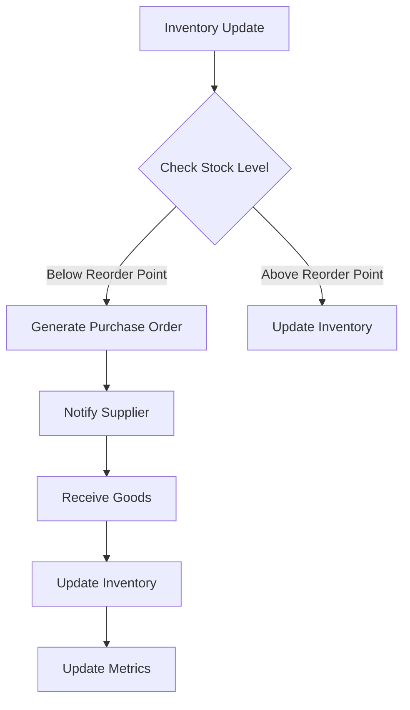
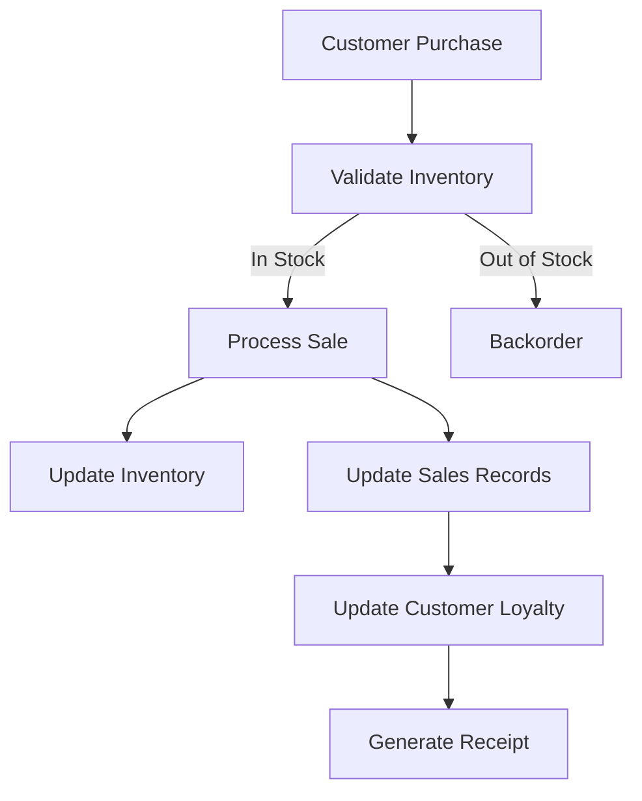
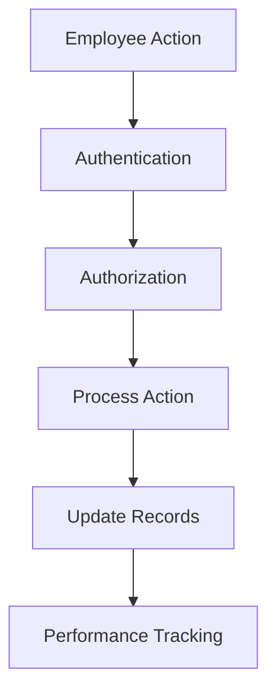
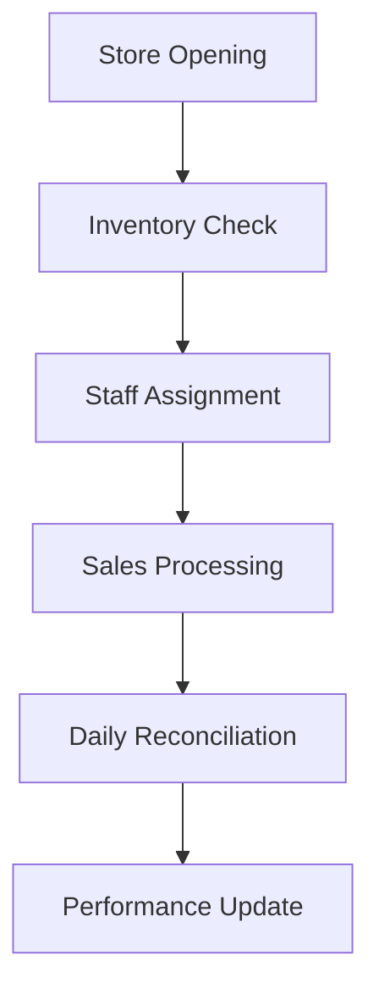
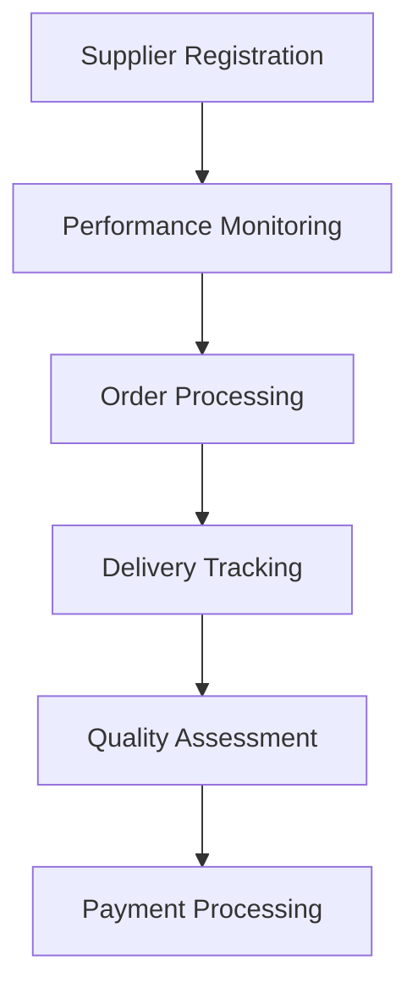
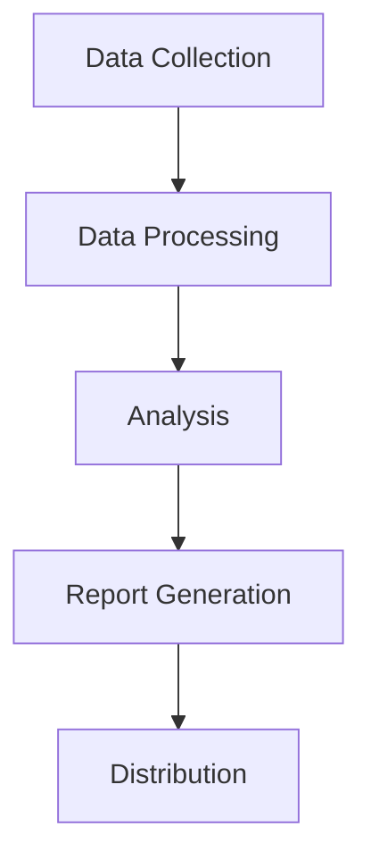

# Retail Inventory Management System

## Project Structure

```
src/
├── procedures/           # Stored procedures organized by module
│   ├── inventory/       # Inventory management procedures
│   ├── employee/        # Employee management procedures
│   ├── store/          # Store management procedures
│   ├── supplier/       # Supplier management procedures
│   ├── sales/          # Sales management procedures
│   └── reporting/      # Reporting and analytics procedures
├── functions/           # Database functions organized by module
│   ├── inventory/      # Inventory-related functions
│   ├── employee/       # Employee-related functions
│   ├── store/         # Store-related functions
│   ├── supplier/      # Supplier-related functions
│   ├── sales/         # Sales-related functions
│   └── reporting/     # Reporting-related functions
├── triggers/           # Database triggers organized by module
│   ├── inventory/     # Inventory-related triggers
│   ├── employee/      # Employee-related triggers
│   ├── store/        # Store-related triggers
│   ├── supplier/     # Supplier-related triggers
│   └── sales/        # Sales-related triggers
├── schemas/            # Database schema definitions
├── data/              # Data files and scripts
└── docs/              # Documentation files
```

## System Workflow

### 1. Inventory Management Flow


#### Key Processes:
1. **Stock Monitoring**
   - Daily inventory checks
   - Automated reorder point detection
   - Real-time stock level updates

2. **Purchase Order Generation**
   - Automatic PO creation
   - Supplier selection
   - Quantity calculation
   - Cost estimation

3. **Goods Receiving**
   - Quality inspection
   - Quantity verification
   - Documentation
   - Stock update

### 2. Sales Process Flow


#### Key Processes:
1. **Sale Processing**
   - Price calculation
   - Discount application
   - Payment processing
   - Receipt generation

2. **Inventory Update**
   - Real-time stock reduction
   - Movement tracking
   - Audit trail maintenance

3. **Customer Management**
   - Loyalty point calculation
   - Purchase history update
   - Customer preferences

### 3. Employee Management Flow


#### Key Processes:
1. **Access Control**
   - Role-based permissions
   - Action validation
   - Security logging

2. **Performance Tracking**
   - Sales metrics
   - Customer satisfaction
   - Efficiency measures

### 4. Store Operations Flow


#### Key Processes:
1. **Daily Operations**
   - Opening procedures
   - Staff scheduling
   - Inventory management
   - Sales processing

2. **End of Day**
   - Sales reconciliation
   - Cash management
   - Inventory verification
   - Performance reporting

### 5. Supplier Management Flow


#### Key Processes:
1. **Supplier Onboarding**
   - Registration
   - Documentation
   - Terms agreement
   - Performance baseline

2. **Order Management**
   - Order placement
   - Delivery tracking
   - Quality control
   - Payment processing

### 6. Reporting and Analytics Flow


#### Key Processes:
1. **Data Collection**
   - Sales data
   - Inventory data
   - Customer data
   - Performance metrics

2. **Analysis and Reporting**
   - Performance analysis
   - Trend identification
   - Report generation
   - Distribution

## Integration Points

### 1. System Integration
- Inventory Management ↔ Sales System
- Sales System ↔ Customer Management
- Employee Management ↔ Store Operations
- Supplier Management ↔ Inventory System
- Reporting System ↔ All Modules

### 2. External Systems
- Payment Gateways
- Shipping Providers
- Accounting Systems
- CRM Systems
- Analytics Platforms

## Data Flow

### 1. Transaction Flow
1. **Sales Transaction**
   - Customer purchase initiation
   - Inventory check
   - Price calculation
   - Payment processing
   - Inventory update
   - Sales record creation
   - Customer loyalty update

2. **Inventory Transaction**
   - Stock level check
   - Reorder point verification
   - Purchase order creation
   - Goods receiving
   - Stock update
   - Supplier payment

3. **Employee Transaction**
   - Action initiation
   - Permission verification
   - Process execution
   - Record update
   - Performance tracking

### 2. Reporting Flow
1. **Daily Reports**
   - Sales summary
   - Inventory status
   - Employee performance
   - Store metrics

2. **Periodic Reports**
   - Financial statements
   - Performance analysis
   - Trend reports
   - Predictive analytics

## Security Workflow

### 1. Access Control
1. **Authentication**
   - User identification
   - Password verification
   - Multi-factor authentication
   - Session management

2. **Authorization**
   - Role verification
   - Permission checking
   - Action validation
   - Access logging

### 2. Data Security
1. **Data Protection**
   - Encryption
   - Backup
   - Audit trails
   - Access control

2. **Compliance**
   - Data privacy
   - Regulatory requirements
   - Security standards
   - Audit requirements

## Maintenance Workflow

### 1. Regular Maintenance
1. **Database Maintenance**
   - Index optimization
   - Statistics updates
   - Backup verification
   - Performance tuning

2. **System Maintenance**
   - Software updates
   - Security patches
   - Performance monitoring
   - Error logging

### 2. Emergency Procedures
1. **Issue Resolution**
   - Problem identification
   - Impact assessment
   - Resolution implementation
   - Verification

2. **Recovery Procedures**
   - System recovery
   - Data restoration
   - Service resumption
   - Post-recovery analysis

## Support and Monitoring

### 1. System Monitoring
- Performance metrics
- Error tracking
- Resource utilization
- Security monitoring

### 2. User Support
- Issue reporting
- Problem resolution
- User training
- Documentation updates

## Documentation
- [Main Documentation](README.md)
- [Functions Documentation](functions.md)
- [Triggers Documentation](triggers.md)

## Database Components

### Stored Procedures
- Inventory management procedures
- Employee management procedures
- Store management procedures
- Supplier management procedures
- Sales management procedures
- Reporting procedures

### Database Functions
- Inventory value calculations
- Employee performance metrics
- Store revenue calculations
- Supplier rating calculations
- Customer loyalty calculations
- Sales metrics calculations
- Report generation functions

### Database Triggers
- Inventory audit and reorder triggers
- Employee record and schedule triggers
- Store audit and performance triggers
- Supplier audit and performance triggers
- Sales audit and inventory triggers
- Customer loyalty triggers

## Database Schema

The system uses both star and snowflake schema models for efficient data warehousing and reporting.

### Core Tables
- Categories
- Brands
- Suppliers
- Products
- Inventory
- Customers
- Employees
- Stores
- Sales
- Purchase Orders

### Star Schema Tables
- Fact_Sales
- Dim_Date
- Dim_Product
- Dim_Customer
- Dim_Store
- Dim_Employee

### Snowflake Schema Tables
- Dim_Product_Category
- Dim_Product_Brand
- Dim_Product_Supplier
- Dim_Customer_Demographics
- Dim_Store_Location
- Dim_Employee_Department

## Stored Procedures

### Inventory Management
1. `proc_update_inventory_quantity`
   - Updates product inventory levels
   - Validates quantity changes
   - Tracks inventory movements
   - Updates related metrics

2. `proc_get_low_stock_products`
   - Identifies products below reorder point
   - Calculates required reorder quantities
   - Provides supplier information
   - Includes cost analysis

### Employee Management
1. `proc_add_new_employee`
   - Creates new employee records
   - Validates unique identifiers
   - Initializes performance metrics
   - Sets up employee schedule

2. `proc_update_employee_position`
   - Updates employee positions
   - Tracks position history
   - Updates related records
   - Maintains data integrity

### Store Management
1. `proc_add_new_store`
   - Creates new store records
   - Initializes store metrics
   - Sets up operating hours
   - Configures inventory tracking

2. `proc_update_store_manager`
   - Updates store management
   - Tracks manager history
   - Updates employee records
   - Maintains store performance

3. `proc_get_store_inventory_value`
   - Analyzes store inventory
   - Provides category breakdown
   - Tracks recent movements
   - Calculates inventory value

### Supplier Management
1. `proc_add_new_supplier`
   - Creates supplier records
   - Validates contact information
   - Initializes performance metrics
   - Sets up supplier tracking

2. `proc_update_supplier_contact`
   - Updates supplier information
   - Tracks contact history
   - Validates changes
   - Maintains data integrity

3. `proc_get_supplier_products`
   - Lists supplier products
   - Provides performance metrics
   - Includes inventory status
   - Shows sales analysis

### Sales Management
1. `proc_add_new_customer`
   - Creates customer records
   - Validates unique identifiers
   - Initializes preferences
   - Sets up loyalty tracking

2. `proc_update_loyalty_points`
   - Updates customer loyalty
   - Tracks point history
   - Updates tier status
   - Maintains rewards

3. `proc_get_customer_sales`
   - Retrieves sales history
   - Provides detailed analysis
   - Includes performance metrics
   - Shows loyalty status

### Reporting
1. `proc_get_top_selling_products`
   - Analyzes product performance
   - Includes sales metrics
   - Shows return rates
   - Calculates profitability

## Usage

### Prerequisites
- Oracle Database 19c or higher
- PostgreSQL 13 or higher
- Required database privileges

### Installation
1. Create database schemas
2. Execute core table creation scripts
3. Create star schema tables
4. Create snowflake schema tables
5. Create stored procedures
6. Create database functions
7. Create database triggers
8. Initialize with sample data

### Maintenance
- Regular database backups
- Performance monitoring
- Index maintenance
- Statistics updates
- Trigger monitoring
- Function optimization

## Security
- Role-based access control
- Data encryption
- Audit logging
- Secure connections
- Trigger security
- Function security

## Performance
- Optimized queries
- Proper indexing
- Partitioned tables
- Materialized views
- Trigger optimization
- Function optimization

## Support
For technical support or questions, please contact the database administration team. 